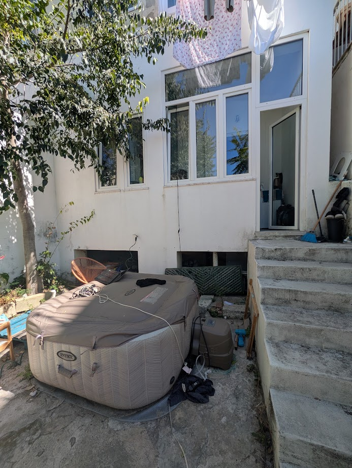
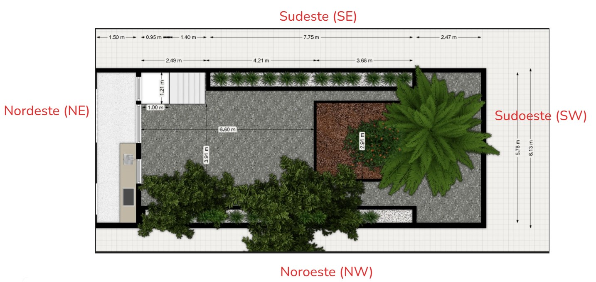
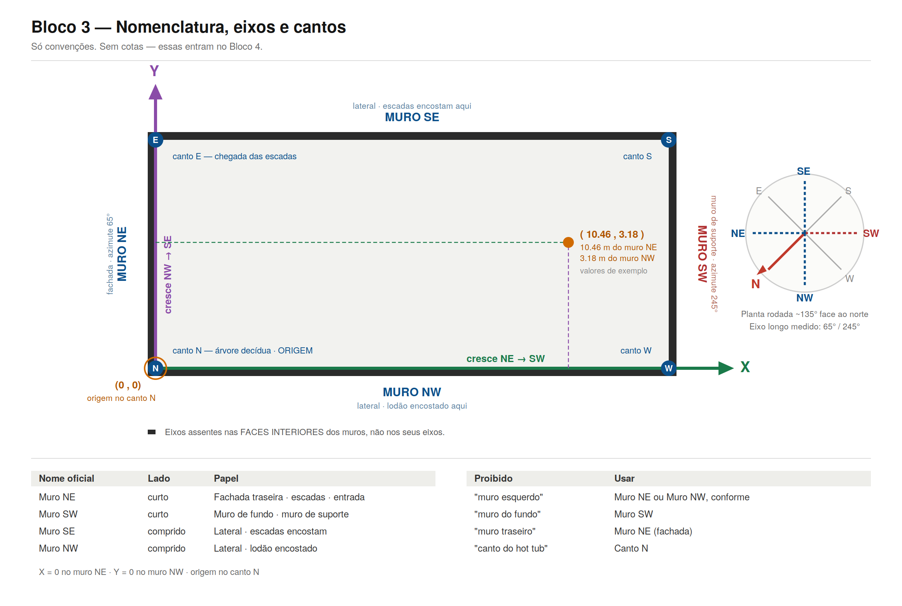
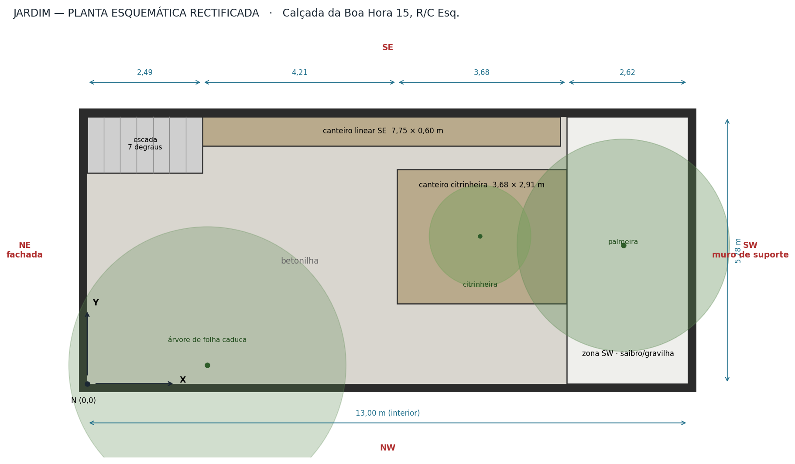
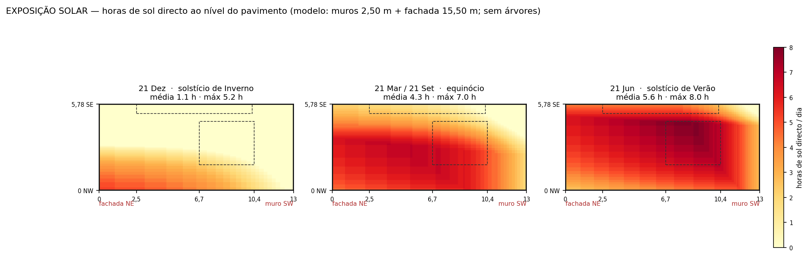
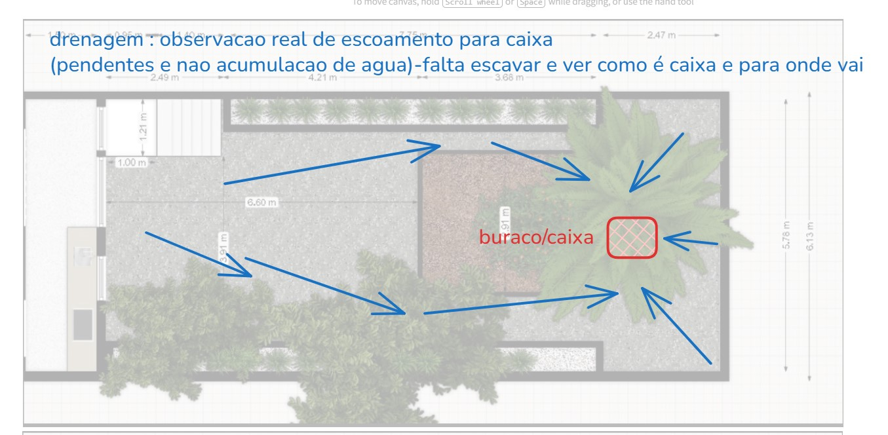
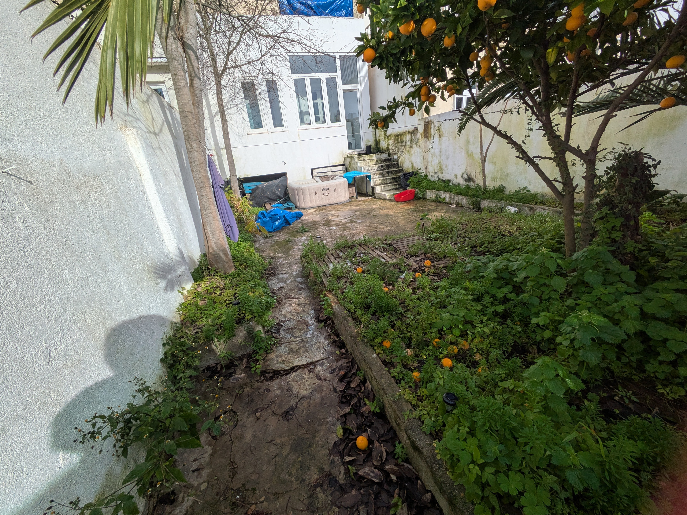
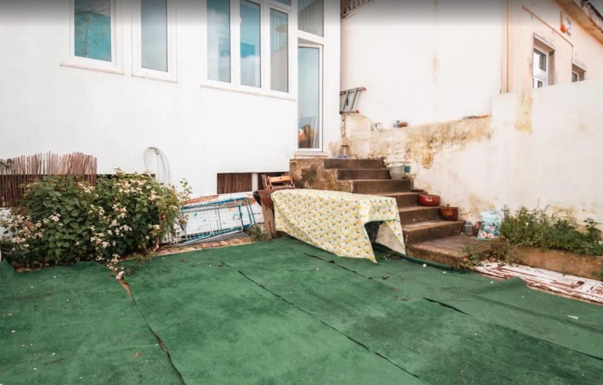
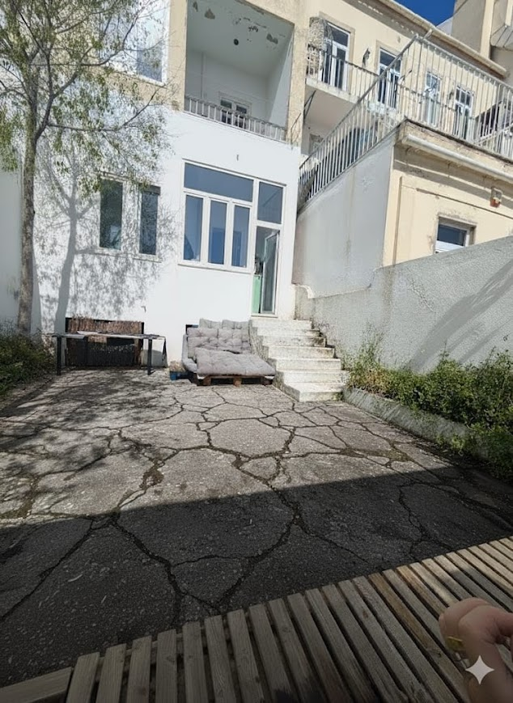
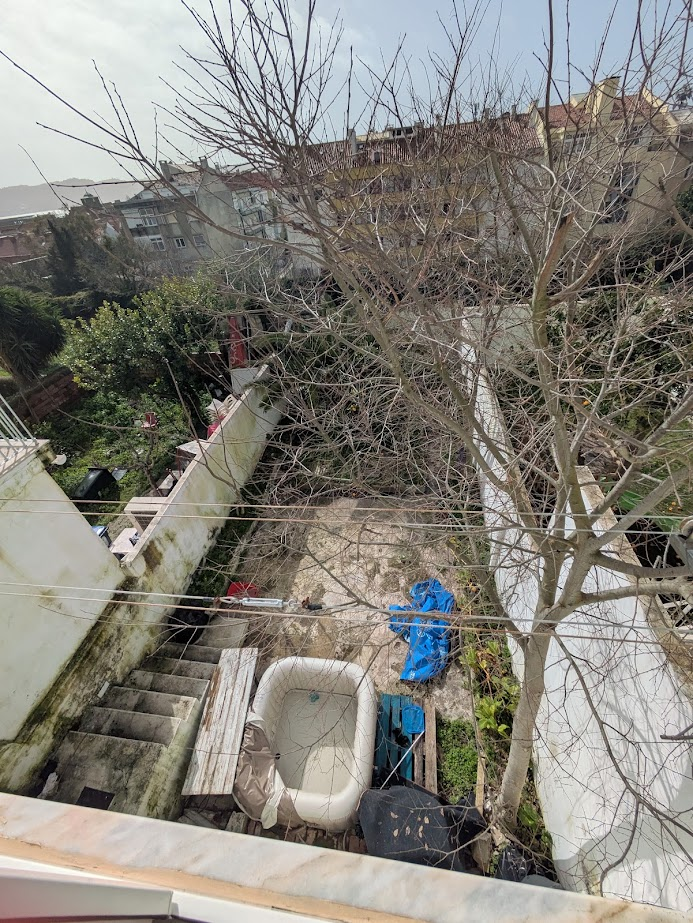

# DOSSIER TÉCNICO — Quintal da Calçada da Boa Hora 15, R/C Esq.

Documento de dados. Deriva do canónico `Planta_e_Espaco_Fisico.md`. Nenhum valor aqui é novo.

**Etiquetas de proveniência:** `[desenho]` lido de desenho cotado · `[foto]` inferido de fotografia · `[observado]` observação directa do proprietário · `[medido]` medido com instrumento · `[estimado]` calculado ou por analogia.

**Semáforo:** 🟢 confirmado (desenho cotado / medição / observação directa confirmada) · 🟡 quase certo (fonte única ou inferência fotográfica) · 🔴 por confirmar (desconhecido ou fontes em conflito).

---

## Índice

1. [Dados gerais](#1-dados-gerais)
2. [Geometria](#2-geometria)
3. [Envolvente e implantação](#3-envolvente-e-implantação)
4. [Estruturas](#4-estruturas)
5. [Exposição solar](#5-exposição-solar)
6. [Água](#6-água)
7. [Superfícies](#7-superfícies)
8. [Vegetação](#8-vegetação)
9. [Infra-estrutura](#9-infra-estrutura)
10. [Secções por instruir](#10-secções-por-instruir)
11. [Índice de imagens](#11-índice-de-imagens)
12. [Por inspeccionar](#12-por-inspeccionar)
13. [Contradições em aberto](#13-contradições-em-aberto)

---

## 1. Dados gerais

**Estado:** 🟢 confirmado

| Campo | Valor | Proveniência |
|---|---|---|
| Morada | Calçada da Boa Hora 15, Alcântara, Lisboa | `[observado]` |
| Fracção | R/C Esquerdo | `[desenho]` · rotulada «RC/ESQ» em `CASA-GOOGLE.jpg` |
| Tipologia | Quintal privativo de fracção, em logradouro de tardoz | `[desenho]` |
| Latitude | 38,69967° N | `[desenho]` |
| Longitude | 9,19038° W | `[desenho]` |
| Altitude | ≈46 m | `[estimado]` |
| Área interior | 75,1 m² | `[desenho]` |
| Área declarada na planta da fracção | «13 × 5,77 = 75» | `[desenho]` |
| Profundidade construída da fracção | ≈12,81 m | `[desenho]` (3,66 + 3,70 + 3,94 + 1,51) |
| Idade do edificado | ≈95 anos | `[estimado]` — sem processo de obra |

---

## 2. Geometria

**Estado:** 🟢 confirmado em planta · 🟡 nas cotas verticais derivadas

### 2.1 Sistema de coordenadas

Origem no **canto N**. **X** cresce da fachada (NE) para o muro de suporte (SW): 0 → 13,00.
**Y** cresce do muro NW para o muro SE: 0 → 5,78. Coordenadas referidas às **faces interiores**.

```
NOMENCLATURA DOS MUROS E CANTOS                         [desenho]

                      MURO SE   (Y = 5,78 · meação · escada encosta aqui)
        E ┌──────────────────────────────────────────────────────┐ S
          │                                                      │
  MURO NE │                                                      │ MURO SW
 (X = 0)  │           planta rodada ≈135° face ao Norte          │ (X = 13,00)
 fachada  │                                                      │ muro de
 az. 65°  │                                                      │ suporte
          │                                                      │ az. 245°
 Y ▲    N └──────────────────────────────────────────────────────┘ W
   │  (0,0)              MURO NW   (Y = 0 · meação · lodão encostado)
   └──► X

  Cantos:  N = NE ∩ NW  (ORIGEM)   E = NE ∩ SE   S = SE ∩ SW   W = SW ∩ NW
  Termos PROIBIDOS: «fundo» · «frente» · «esquerda» · «direita» · «lado de cima»
```

### 2.2 Dimensões

| Grandeza | Valor | Proveniência | Estado |
|---|---|---|---|
| Comprimento interior (X) | 13,00 m | `[desenho]` | 🟢 |
| Largura interior (Y) | 5,78 m | `[desenho]` | 🟢 |
| Largura exterior | 6,13 m | `[desenho]` | 🟢 |
| Espessura dos muros | 0,18 m | `[desenho]` (6,13 − 5,78) | 🟢 |
| Área interior | 75,1 m² | `[desenho]` | 🟢 |
| Altura dos muros SE/NW/SW acima do solo | **≤2,50 m** | `[observado]` 2026-09-15 | 🟢 |
| Muretes de delimitação de canteiros | ≈0,15 m espessura | `[desenho]` | 🟢 |

**Cadeia de cotas em X:** `0 → 2,49 → 6,70 → 10,38 → 13,00` m `[desenho]`

### 2.3 Planta esquemática cotada

```
PLANTA — 13,00 × 5,78 m interior                        [desenho]
Cadeia X:  0 ───2,49─── 2,49 ───4,21─── 6,70 ───3,68─── 10,38 ──2,62── 13,00

 X=0        X=2,49              X=6,70            X=10,38    X=13,00
 │            │                   │                  │          │
E├────────────┼───────────────────┼──────────────────┼──────────┤S   Y=5,78
 │  ESCADA    │ canteiro linear SE  7,75 × 0,60                 │    ▲ MURO SE
 │  7 degraus ├───────────────────┬──────────────────┤          │    │ Y=5,15
 │  larg 1,21 │                   │ CANTEIRO         │  ZONA SW │    │
 │  Y 4,57→   │                   │ CITRINHEIRA      │  saibro/ │    │ Y=4,64
 │     5,78   │                   │ 3,68 × 2,91      │  gravilha│    │
 │            │   BETONILHA       │   ⊕ citrinheira  │          │    │
 │            │   plataforma      │   X≈8,5 Y≈3,2    │   ✻      │    │ Y=3,5 ◉
 │  ⌂ porta   │   central         │                  │ PALMEIRA │    │ ◉ = orifício
 │  fachada   │   ≈45 m²          │                  │ X≈11,6   │    │   de drenagem
 │            │                   │                  │ Y≈3,0    │    │   X≈11,7 Y≈3,5
 │            │                   ├──────────────────┤          │    │ Y=1,73
 │  ♣ lodão   │                   │                  │          │    │
N└────────────┴───────────────────┴──────────────────┴──────────┘W   Y=0
 (0,0)                     MURO NW                                    MURO SW
 ♣ = Celtis australis X≈2,6 Y≈0,4                                     (suporte)
```

### 2.4 Cotas verticais

| Grandeza | Valor | Proveniência | Estado |
|---|---|---|---|
| Solo do jardim → patim superior da escada | 1,35 m | `[desenho]` — corte anotado | 🟢 |
| Solo do jardim → soleira da fracção | ≈1,60 m | `[estimado]` | 🟡 |
| Altura total do edifício | 15,50 m | `[desenho]` — aceite por verificação de escala | 🟡 |
| Pé-direito entre pisos | 3,10 m | `[desenho]` — aceite por verificação de escala | 🟡 |
| Terras retidas pelo muro SW, abaixo da cota do jardim | ≈5 m | `[observado]` | 🟡 |
| Altura total do muro SW | ≈7,5 m | `[observado]` (2,50 + ≈5) | 🟡 |
| Peitoris das janelas acima do solo do jardim | ≈2,00 m | `[foto]` | 🟡 |

### 2.5 Corte esquemático

```
CORTE NE → SW (não à escala vertical)                   [desenho] + [observado]

 NE                                                              SW
  ▲
  │ ┌─────────┐ cobertura
  │ │ piso 3  │
  │ ├─────────┤
15,50 m       │  pé-direito entre pisos 3,10 m  [desenho]
  │ ├─────────┤
  │ │ piso 1  │ varanda em consola sobre o jardim [foto]
  │ ├─────────┤
  │ │ R/C Esq │  soleira ≈1,60 m  [estimado]
  ▼ └──┬──────┤
       │escada│ 1,35 m  [desenho] · 7 degraus
       └──┬───┴╌╌╌╌╌╌╌╌╌╌╌╌╌╌╌╌╌╌╌╌╌╌╌╌╌╌╌╌╌╌╌╌╌╌╌┐  ┈┈┈┈┈┈ cota do jardim
          │◄─────────── 13,00 m ──────────────────►│  ▲
          │        pavimento do jardim             │  │ 2,50 m  [observado]
          ╞════════════════════════════════════════╡  ▼ guarda acima do solo
          │▒▒▒▒▒ TERRAS DO PRÓPRIO JARDIM ▒▒▒▒▒▒▒▒▒│█ ▲
          │▒▒▒▒▒▒▒▒▒▒▒▒▒▒▒▒▒▒▒▒▒▒▒▒▒▒▒▒▒▒▒▒▒▒▒▒▒▒▒▒│█ │ ≈5 m  [observado]
          │▒▒▒▒▒▒▒▒▒▒▒▒▒▒▒▒▒▒▒▒▒▒▒▒▒▒▒▒▒▒▒▒▒▒▒▒▒▒▒▒│█ │ terras retidas
          └────────────────────────────────────────┴█ ▼
                                                     └──► logradouro aberto
                                                          SEM vizinho, SEM
                                                          terras alheias
                                                          [observado]
       Total do muro SW ≈7,5 m  ·  corte de arquitectura dá 3 + 7 = 10 m 🔴
```

### 2.6 Escada

**Estado:** 🟢 em planta · 🟡 na geometria dos degraus

| Grandeza | Valor | Proveniência | Estado |
|---|---|---|---|
| Posição em X | 0 → 2,49 m | `[desenho]` | 🟢 |
| Posição em Y | 4,57 → 5,78 m | `[desenho]` | 🟢 |
| Largura útil | 1,21 m | `[desenho]` | 🟢 |
| N.º de degraus | 7 | `[foto]` | 🟡 |
| Espelho | ≈0,19 m | `[estimado]` | 🟡 |
| Cobertor | ≈0,30 m | `[estimado]` | 🟡 |
| Primeiro degrau (mais profundo) | ≈0,50 m | `[foto]` | 🟡 |
| Blondel (2h + b) | ≈0,68 m — acima do conforto 0,60–0,65 | `[estimado]` | 🟡 |

Murete lateral do lado NW. Vão livre sob o lanço `[foto]`.
`Foto3.jpg` declara 1,50 m; a planta cotada dá 1,21 m — ver contradição §13/C12.

---

## 3. Envolvente e implantação

**Estado:** 🟢 confirmado

| 🟢 Confirmado | 🟡 A melhorar | 🔴 A inspeccionar |
|---|---|---|
| Dois jardins lado a lado numa frente de ≈13 m `[desenho]` | Altura exacta do edifício (15,50 m vem de desenho de **proposta**) | — |
| O nosso é o do lado **SE**; o do vizinho a NW `[desenho]` | | |
| Único obstáculo alto é o próprio prédio, a NE `[desenho]` | | |
| Muros de meação confinam com jardins **ao mesmo nível** `[foto]` | | |
| A SW é tudo livre: terreno desce ≈7 m para logradouro aberto `[foto]` | | |
| Prédios do outro lado do logradouro: afastados e a cota inferior `[foto]` | | |

```
IMPLANTAÇÃO — frente do prédio ≈13 m                    [desenho]

            CALÇADA DA BOA HORA (NE) — via com tráfego
   ════════════════════════════════════════════════════
            ┌──────────── PRÉDIO N.º 15 ──────────────┐
            │            15,50 m de altura            │
            └────────────────┬────────────────────────┘
                             │ frente ≈13 m
      ┌──────────────────────┼──────────────────────┐
      │  JARDIM DO VIZINHO   │   O NOSSO QUINTAL    │
      │       ≈6,9 m         │      6,13 m ext.     │
      │         NW           │         SE           │
      │                      │  13,00 m profundidade│
      └──────────────────────┴──────────────────────┘
                     ╞══ MURO DE SUPORTE (SW) ══╡
                     ▼ terreno desce ≈7 m
            ┌─────────────────────────────────┐
            │   LOGRADOURO ABERTO — sem       │
            │   construção, árvores dispersas │
            └─────────────────────────────────┘
              fila de prédios ao fundo, a cota inferior
              → horizonte angular de poucos graus
```

---

## 4. Estruturas

**Estado:** 🟡 misto

| 🟢 Confirmado | 🟡 A melhorar | 🔴 A inspeccionar |
|---|---|---|
| Altura dos muros ≤2,50 m `[observado]` | Terras retidas ≈5 m `[observado]`, fonte única | Tipo construtivo do muro SW |
| Muro SW retém as terras do **próprio jardim** `[observado]` | Altura do edifício 15,50 m `[desenho de proposta]` | Fundação e capacidade de carga |
| Não há vizinho nem terras alheias a SW `[observado]` | Degradação do muro SE `[foto]` | Origem da humidade no muro SE |
| Geometria da escada em planta `[desenho]` | | Coroa (remate superior) de todos os muros |
| | | Estado do muro NW (nunca fotografado de frente) |

### 4.1 Os quatro muros

| Muro | Coord. | Natureza | Altura relevante | Estado do elemento |
|---|---|---|---|---|
| **NE** | X = 0 | Fachada do tardoz. Porta + janelas. Varanda em consola do 1.º piso. Duas grelhas de ventilação no tecto da consola. | 15,50 m `[desenho]` | 🟡 |
| **SE** | Y = 5,78 | Meação. **Degradação significativa**: escorrências verticais, colonização biológica, reboco degradado e destacado. | ≤2,50 m `[observado]` | 🔴 origem da humidade |
| **SW** | X = 13,00 | **Muro de suporte.** Não é divisória — é fundação. | ≈7,5 m totais | 🔴 tipo e fundação |
| **NW** | Y = 0 | Meação com o jardim vizinho. Estado aparentemente melhor que o SE `[foto]`. Escorrência verde na base. | ≤2,50 m `[observado]` | 🟡 |

### 4.2 Muro SW — dados

| Grandeza | Valor | Proveniência |
|---|---|---|
| Acima da cota do jardim (guarda) | ≤2,50 m | `[observado]` |
| Abaixo da cota do jardim (terras retidas) | ≈5 m | `[observado]` |
| Total | ≈7,5 m | `[observado]` |
| Terras que retém | **as do próprio jardim** | `[observado]` |
| Vizinho / construção / terras alheias do lado exterior | **nenhum** | `[observado]` |
| Tipo construtivo | desconhecido | 🔴 |
| Fundação | desconhecida | 🔴 |
| Capacidade de carga | desconhecida | 🔴 |
| Processo de obra original | não consultado (Arquivo Municipal de Lisboa) | 🔴 |

O jardim assenta no topo deste muro. Carga acrescentada junto à coroa vai para o tardoz do muro, na zona de maior momento.

---

## 5. Exposição solar

**Estado:** 🟢 geometria astronómica · 🟡 horas modeladas · 🔴 efeito da vegetação

| 🟢 Confirmado | 🟡 A melhorar | 🔴 A inspeccionar |
|---|---|---|
| Coordenadas 38,69967° N · 9,19038° W | Horas de sol por zona `[estimado]` | Sombreamento real da palmeira |
| Alturas máximas 27,9° / 74,7° (NREL SPA) | Horas de primeira luz `[estimado]` | Sombreamento real do lodão |
| Gamas de azimute 120,2° / 242,8° · **eixo longo 65°/245°** | Horas de entrada `[estimado]` | DLI medido |
| Modelo validado contra 3 fotos datadas | | |

### 5.1 Geometria solar — valores astronómicos

Calculados com NREL SPA / pvlib. `[desenho]`

| Grandeza | 21 Dez (Inverno) | 21 Jun (Verão) |
|---|---|---|
| Azimute ao nascer | 119,9° | 58,6° |
| Azimute ao pôr | 240,1° | 301,4° |
| **Gama de azimutes do dia** | **120,2°** | **242,8°** |
| **Altura solar máxima** | **27,9°** | **74,7°** |
| Nascer astronómico (hora local) | 07:51 | 06:12 |
| Pôr astronómico (hora local) | 17:19 | 21:05 |

### 5.2 Percurso solar — Inverno vs Verão

```
PERCURSO SOLAR — altura × azimute, visto do jardim      [desenho]

 altura
  80°┤                        ╭─────╮ 74,7° ◄── VERÃO 21 Jun
     │                    ╭───╯     ╰───╮
  60°┤                ╭───╯             ╰───╮
     │            ╭───╯                     ╰───╮
  40°┤        ╭───╯                             ╰───╮
     │    ╭───╯        ╭────╮ 27,9° ◄── INVERNO      ╰───╮
  20°┤╭───╯        ╭───╯    ╰───╮ 21 Dez                 ╰───╮
     ││        ╭───╯            ╰───╮                        │
   0°┼┴────────┴────┬────┬───┬───┬──┴─┬────┬────────────────┴──►
     58,6°   90°  119,9° 155° 180° 240,1°  270°  301,4°   azimute
       │      E     │     SE   S     │      W      │
       │            │  ← plano da    │             │
     NASCER       NASCER   fachada  PÔR          PÔR
     VERÃO        INVERNO  (155°)  INVERNO      VERÃO

  ┌── ZONA SEM SOL ──┐
  │ az < 155°        │  o prédio (NE, 15,50 m) tapa tudo
  │ = manhã inteira  │  antes de o Sol passar o plano da fachada
  └──────────────────┘
```

**Orientação, de costas para o prédio:** à frente **SW 245°** · à esquerda **SE 155°** · à direita **NW 335°** · atrás, o prédio, **NE 65°** `[desenho]`.

### 5.3 Hora de entrada e saída do sol no jardim

Não há sol enquanto o Sol não passar o plano da fachada (azimute **155°**). > **Recalculado 2026-09-15.** Valores para o plano da fachada a **155°**, na sequência da resolução da contradição C3 (azimute do eixo longo a 65°/245°, não 60°/240°). Atraso face aos valores anteriores: **+22 min** em Dezembro, +15 em Março, +13 em Setembro, +8 em Maio, +7 em Junho — maior no Inverno, porque o Sol percorre o azimute mais devagar quando está baixo.
>
> **Corrigido em simultâneo um erro independente:** o valor anterior de 21 Mar (11:28) não correspondia a nenhum plano de fachada plausível — a essa hora o azimute solar é 133°, não 150°. As restantes quatro datas reproduziam-se a ±4 min. Era erro isolado dessa linha.

Horas locais `[estimado]`.

| Data | Primeira luz no jardim | Pôr do sol |
|---|---|---|
| 21 Dez | 10:56 | 17:16 |
| 21 Mar | 12:40 | 18:48 |
| 27 Mai | 13:01 | 20:48 |
| 21 Jun | **13:09** | 21:00 |
| 11 Set | 12:33 | 19:48 |

### 5.4 Sol directo ao nível do pavimento

Modelo: muros 2,50 m · fachada 15,50 m · rectângulo 13,00 × 5,78 m · **sem árvores**. `[estimado]`

| Zona | 21 Dez | Equinócio | 21 Jun |
|---|---|---|---|
| Junto à fachada (X 0–2,5) | 1,7 h | 5,0 h | 5,2 h |
| Plataforma central (X 2,5–6,7) | 1,5 h | 5,2 h | 5,9 h |
| Canteiro da citrinheira | 0,2 h | 4,8 h | 7,3 h |
| Canteiro linear SE | 0,0 h | 1,3 h | 4,6 h |
| Zona SW / palmeira | 0,1 h | 2,1 h | 4,2 h |
| **Média do jardim inteiro** | **1,1 h** | **4,3 h** | **5,6 h** |
| Máximo pontual | 5,2 h | 7,0 h | 8,0 h |

**Sensibilidade:** baixar os muros de 3,00 → 2,50 m **duplica** a média de Dezembro (0,5 → 1,1 h) e quase não mexe no Verão.

### 5.5 Validação com fotografias datadas

| Fotografia | Sol calculado | Modelo prevê | Fotografia mostra | Verdicto |
|---|---|---|---|---|
| `SOL-VAL-20250527-1059.jpg` 27 Mai 2025, 10:59 | alt 52,6° · az 106° | Metade junto à fachada em sombra; metade SW iluminada | Primeiro plano junto à escada em sombra; extremo SW, palmeira e muro de topo em sol | ✔ |
| `SOL-VAL-20250326-1647.jpg` 26 Mar 2025, 16:47 | alt 23,8° · az 253° | Inverso: metade junto à fachada iluminada; extremo SW em sombra | Mancha de sol na zona central junto à escada; faixa junto ao muro de topo em sombra | ✔ |
| `SOL-VAL-20260911-1200.jpg` 11 Set 2026, 12:00 | alt 49,7° · az 142° | Faixa iluminada do lado NW (Y 0–3,2) | Compatível; a copa do lodão domina a leitura | ~ |

O modelo reproduz a inversão manhã/tarde. Considera-se verificado **para muros e edifício**.

### 5.6 Limitações do modelo

| Factor não modelado | Efeito | Período |
|---|---|---|
| Palmeira (zona SW) | Retira sol real à zona SW | Todo o ano |
| Lodão-bastardo (metade NW) | Sombreia a metade NW | Só em folha — despido em Dez/Jan |

Nenhum outro factor subtrai aos valores da tabela.

---

## 6. Água

**Estado:** 🟢 que existe drenagem a funcionar · 🔴 para onde descarrega

| 🟢 Confirmado | 🟡 A melhorar | 🔴 A inspeccionar |
|---|---|---|
| O pavimento tem pendente efectiva `[observado]` | Posição do orifício X≈11,7 Y≈3,5 (lida do diagrama) | **O que é o orifício** — nunca aberto |
| A água corre sempre pelo mesmo trajecto `[observado]` | Lâmina de água em 9 Fev 2026 `[foto]` | **Para onde descarrega** |
| **Não há encharcamento** `[observado]` | | Capacidade e estado (secção, obstrução, colapso) |
| Converge para a zona SW junto à palmeira `[observado]` | | Idade e tipo |
| Existe orifício com aparência de caixa `[observado]` | | Se há mais pontos de recolha |
| **Nunca satura**, mesmo com caudal forte `[observado]` | | Pendentes em valor (só se conhece o sentido) |
| Intenção construtiva legível no pavimento `[observado]` | | |

### 6.1 Diagrama de escoamento

```
ESCOAMENTO OBSERVADO — 8 trajectos convergentes         [observado]

 X=0                                                          X=13,00
E┌─────────────────────────────────────────────────────────────┐S  Y=5,78
 │                                                             │
 │  ESCADA    ──────►──────►                                   │
 │                          ╲                                  │
 │                           ╲──────►──────►╲                  │
 │                                           ╲                 │
 │   BETONILHA ──────►──────►──────►──────►───╲                │
 │   plataforma                                ╲   ◉◄──────    │  Y≈3,5
 │   central                                   ╱ buraco/caixa  │
 │             ──────►──────►                 ╱  (nunca aberto)│
 │                            ╲──────►──────►╱ ▲               │
 │                                             ╲◄──────        │
 │                                                             │
N└─────────────────────────────────────────────────────────────┘W  Y=0
                                                     ZONA SW
                                                     junto à palmeira

  ◉ = orifício de drenagem · X ≈ 11,7 · Y ≈ 3,5  [observado, lido do diagrama]

  ESTABELECIDO:                      EM ABERTO:
  ┌────────────────────────┐         ┌──────────────────────────────┐
  │ Existe drenagem        │         │ Liga a ramal/colector?   🔴  │
  │ construída a funcionar │   ──►   │    ou                        │
  │ (nunca satura)         │         │ Descarrega no tardoz do  🔴  │
  └────────────────────────┘         │ muro de suporte?             │
                                     └──────────────────────────────┘
                                     Os dois casos produzem o MESMO
                                     sintoma visível. Só abrindo se sabe.
```

### 6.2 Raciocínio que estabelece a drenagem construída

| Observação | O que exclui |
|---|---|
| O ponto de recolha **nunca satura**, mesmo com precipitação forte | Absorção radicular ou percolação em solo — um volume de terra tem capacidade finita e saturaria |
| O escoamento é **constante em trajecto** ao longo de anos | Acaso; há pendente construída |
| A intenção construtiva é **legível no pavimento** | Improviso posterior |

**Conclusão:** o orifício descarrega num vazio com capacidade — ramal, colector ou dreno construído. `[observado]` + inferência aceite.

**Excluído:** a hipótese de a palmeira absorver a água. Beneficia dela, mas não é ela que a faz desaparecer.

### 6.3 Hipótese registada — rebaixamento do muro SW

Intenção de transformação, **não facto**. Enunciado: substituir parte da altura do muro SW por ≈1 m de alvenaria encimada por gradeamento leve, para passar luz e ventilar.

| Facto do local que a condiciona | Ref. |
|---|---|
| Muro SW é fundação, não divisória: retém ≈5 m das terras do próprio jardim | §4 |
| 2,50 m de guarda + ≈5 m de terras = ≈7,5 m totais | §2.4, §4 |
| Não há vizinho, construção nem terras alheias do lado de fora | §4 |
| A parte a rebaixar está **acima** das terras retidas | §2.5, §4 |
| Tipo construtivo, fundação e capacidade de carga desconhecidos | §4 |
| No Inverno cada 10 cm de muro conta; no Verão não mexe | §5.4 |
| A SW o horizonte já está livre — o ganho seria ao nível do pavimento | §3, §5 |
| **Toda a água do quintal corre para junto desse muro** | §6 |

A intervenção proposta e o ponto de drenagem estão **no mesmo sítio**.

---

## 7. Superfícies

**Estado:** 🟡 material e patologias por foto · 🔴 espessura e suporte

| 🟢 Confirmado | 🟡 A melhorar | 🔴 A inspeccionar |
|---|---|---|
| Geometria dos canteiros `[desenho]` | Betonilha em toda a área fora dos canteiros `[foto]` | Espessura da betonilha |
| Muretes ≈0,15 m `[desenho]` | Zona SW em material solto (saibro/gravilha) `[foto]` | Existência de sub-base |
| A relva artificial já não existe `[observado]` | Duas naturezas de pavimento em `Foto2.jpg` `[foto]` | Estado da laje sob a betonilha |
| | Fissuração generalizada `[foto]`, datada Out 2025 | Profundidade útil dos canteiros |

### 7.1 Material

**Betonilha** em toda a área fora dos canteiros `[foto]`. Substituiu a relva artificial anterior.
Zona SW acabada em material solto, saibro ou gravilha `[foto]`.
`Foto2.jpg` mostra **duas naturezas de superfície** nitidamente distintas: betonilha clara fissurada em rede junto à fachada, e uma faixa escura, quase negra, tipo betuminoso, também fissurada `[foto]`.

**Datação da remoção da relva artificial:** entre 27 Mai 2025 (`SOL-VAL-20250527-1059.jpg`, ainda presente) e 26 Out 2025 (`Betonilha-estado-1.jpg`, já ausente). `[foto]`

### 7.2 Patologias

| Patologia | Onde | Evidência | Data da evidência |
|---|---|---|---|
| Rede de fissuração generalizada | Toda a superfície | `Betonilha-estado-1.jpg` | 26 Out **2025** |
| Fissura passante | Murete da plataforma central | `Betonilha-estado-1.jpg` | 26 Out 2025 |
| Cavidade escura no pavimento junto ao murete | Zona do canteiro da citrinheira | `Betonilha-estado-1.jpg` | 26 Out 2025 |
| Vegetação infestante nas fissuras | Toda a superfície, densa junto aos muros | `JARDIM-GERAL-inverno.jpg` | 6 Fev 2026 |
| Colonização biológica e escorrências | Base dos muros SE e NW | `JARDIM-GERAL-inverno.jpg` | 6 Fev 2026 |

Todas `[foto]`. **Nota:** há quase um ano entre as duas fontes — a fissuração documentada é de Out 2025 e pode ter evoluído.

**NÃO é patologia:** «água estagnada em lençol, sem escoamento aparente». Retirado em 2026-09-15. O quintal escoa — ver §6.

**Leitura:** fissuração generalizada e não localizada aponta para retracção e ausência de juntas, não para assentamento pontual. A vegetação nas fissuras é consequência, não causa.

### 7.3 Canteiros e plataforma

| Elemento | X | Y | Dimensões | Área |
|---|---|---|---|---|
| Canteiro linear SE | 2,49 → 10,24 | 5,15 → 5,78 | 7,75 × ≈0,60 m | ≈4,7 m² |
| Canteiro da citrinheira | 6,70 → 10,38 | 1,73 → 4,64 | 3,68 × 2,91 m | ≈10,7 m² |
| Zona SW (material solto) | 10,38 → 13,00 | 0 → 5,78 | 2,62 × 5,78 m | ≈15,1 m² |
| **Plataforma central (betonilha)** | — | — | área restante | **≈45 m²** |

Todos `[desenho]`. A plataforma central é a única superfície livre e contínua do jardim.

---

## 8. Vegetação

**Estado:** 🟡 posições em planta · 🔴 dimensões e espécie

| 🟢 Confirmado | 🟡 A melhorar | 🔴 A inspeccionar |
|---|---|---|
| Posições em planta `[desenho]` | Altura do lodão ≈5 m `[estimado]` | Altura e diâmetro de copa da palmeira |
| Palmeira é o exemplar dominante `[foto]` | Copas transbordam `[desenho]` | Espécie da citrinheira |
| Lodão é de folha caduca `[foto]` | | Espécies das herbáceas |
| Citrinheira dá fruto (laranjas, Fev) `[foto]` | | |

| Espécie | Posição | Nota | Proveniência |
|---|---|---|---|
| Palmeira *Phoenix canariensis* | Zona SW · X ≈11,6 · Y ≈3,0 | Exemplar dominante. Copa transborda sobre o canteiro da citrinheira. Sombreia a zona SW todo o ano. | posição `[desenho]`, copa `[estimado]` |
| Citrinheira | Canteiro X 6,70–10,38 · X ≈8,5 · Y ≈3,2 | **Espécie a confirmar.** Frutos de Fev compatíveis com laranjeira, não identificados. | posição `[desenho]` |
| Lodão-bastardo *Celtis australis* | Junto ao canto **N** · X ≈2,6 · Y ≈0,4 | Folha caduca. Altura ≈5 m. Copa transborda para lá do muro NW. Despido em Dez/Jan. | posição `[desenho]`, altura `[estimado]` |
| Herbáceas e gramíneas | Canteiro linear SE | Espécies não identificadas. | `[foto]` |

---

## 9. Infra-estrutura

**Estado:** 🔴 por instruir — fonte única para electricidade, quase nula para água

| 🟢 Confirmado | 🟡 A melhorar | 🔴 A inspeccionar |
|---|---|---|
| — | Existe tomada exterior com ficha ligada `[foto]` | Localização do quadro |
| | Existe cabo a descer a parede `[foto]` | N.º de circuitos exteriores |
| | Existem 2 grelhas de ventilação da caixa de ar `[foto]` | Existência de diferencial |
| | Existiu mangueira pendurada na parede (estado antigo) `[foto]` | Potência suportada |
| | | **Existência de torneira exterior** — nunca fotografada |
| | | Canalização enterrada |
| | | Iluminação existente: fixa ou temporária |

### 9.1 Electricidade

**Fonte única do acervo inteiro: `Foto2b.jpg`** (EXIF 2026-09-11 11:56:03).

| Elemento visível | Detalhe | Proveniência |
|---|---|---|
| Tomada eléctrica exterior | Na parede da fachada NE, com ficha ligada | `[foto]` |
| Cabo | Desce pela parede a partir da tomada | `[foto]` |
| Unidade de bomba | Do jacuzzi insuflável, no pavimento | `[foto]` |
| Mangueira / cabo branco | Ligado ao jacuzzi | `[foto]` |



**Desconhecido:** onde está o quadro, quantos circuitos servem o exterior, se há diferencial, que potência suporta, se há canalização enterrada, se a alimentação do jacuzzi é fixa ou por extensão a partir do interior. 🔴

### 9.2 Água

| Elemento | Evidência | Proveniência |
|---|---|---|
| Mangueira enrolada pendurada na parede | `Foto5-Escada.jpg` — **estado antigo**, com relva artificial | `[foto]` |
| Mangueira / cabo branco junto ao jacuzzi | `Foto2b.jpg` | `[foto]` |
| **Torneira exterior** | **nenhuma imagem a mostra** | 🔴 |

Não se sabe se existe ponto de água no jardim, onde está, que pressão tem, nem se há qualquer automatismo. 🔴

### 9.3 Ventilação

| Elemento | Localização | Proveniência |
|---|---|---|
| Duas grelhas rectangulares baixas na fachada NE | Ao nível do pavimento — respiradouros de caixa de ar | `[foto]` (`Foto2b.jpg`) |
| Duas grelhas de ventilação no tecto da consola da varanda | Muro NE | `[foto]` |

### 9.4 Iluminação existente

Só festiva, nunca inventariada.

| Peça | Onde | Fonte | Fixa ou temporária? |
|---|---|---|---|
| Festão de globos | Entre a palmeira e o muro | `Foto1b.jpg` (6 Mai 2026) | 🔴 |
| Lanternas de papel às riscas | Suspensas sobre a plataforma | `Foto1c.jpg` (11 Set 2026) | 🔴 |
| Objectos cilíndricos escuros no chão (projectores/balizadores?) | Junto ao canteiro | `JARDIM-GERAL-inverno.jpg` | 🔴 |

Nenhuma destas peças está inventariada, nem se sabe como são alimentadas. 🔴

---

## 10. Secções por instruir

**Estado:** 🔴 por confirmar — cobertura documental zero ou quase zero

| # | Tema | O que falta | Como se obtém | Custo | Tempo |
|---|---|---|---|---|---|
| S1 | **Solo e substrato** | Profundidade útil dos canteiros; se assenta sobre laje ou terreno; textura, pH, drenagem interna. Cobertura **zero** — os canteiros aparecem sempre cobertos de vegetação. | Sondagem manual com vara/trado em cada canteiro + análise laboratorial de amostra | 30–80 € (análise) | Meia tarde + 1–2 semanas de laboratório |
| S2 | **DLI medido** | Luz diária integrada real por zona. Só existe modelo geométrico `[estimado]`, sem vegetação. | Sensor PAR/DLI de baixo custo, 1 por zona, registo contínuo | 60–200 €/sensor | 2–4 semanas de registo por estação |
| S3 | **Microclima** | Temperatura, humidade, geada, efeito de caixa entre muros. Cobertura zero. | Data-loggers de temperatura/HR em 2–3 pontos | 30–60 €/logger | 1 ciclo anual para ser útil |
| S4 | **Vento** | Cobertura zero. Evidência indirecta apenas: roupa estendida em quase todas as fotos de bom tempo. Um quintal entre muros de 2,5 m com o lado SW aberto sobre um vazio de ≈7 m pode ter comportamento particular. | Anemómetro registador na zona SW e na plataforma central | 40–150 € | 4–8 semanas, em estação ventosa |
| S5 | **Cargas** | Capacidade de carga do muro SW e do pavimento. Tipo construtivo e fundação desconhecidos. Determina o que pode ser acrescentado junto à coroa. | Processo de obra no Arquivo Municipal de Lisboa + sondagem de fundação | 0–50 € (arquivo) | 1–3 semanas de espera do arquivo |
| S6 | **Acessos para materiais** | Cobertura **zero**. Único acesso documentado é **pela fracção**: marquise → porta envidraçada → 7 degraus de 1,21 m. Não se sabe se existe portão de tardoz, passagem pelo jardim vizinho ou acesso pelo logradouro a SW. | Pergunta directa ao proprietário + inspecção do perímetro | 0 € | 15 minutos |
| S7 | **Privacidade / exposição visual** | Nunca tratada. Evidência dispersa: janelas do prédio vizinho a SE dão sobre o quintal; varanda e escada exterior do prédio amarelo contíguo; o jardim vizinho a NW é visível por cima do muro. Consequência para um jardim de uso nocturno. | Levantamento fotográfico de cada janela/varanda com vista sobre o quintal, do jardim para fora e de fora para o jardim | 0 € | Meia tarde |
| S8 | **Ruído** | Cobertura zero. Envolvente sugere via com tráfego a NE (Calçada da Boa Hora, com estacionamento dos dois lados) e logradouro aberto a SW. | Sonómetro ou app calibrada, medições em 3 períodos (manhã/tarde/noite) | 0–100 € | 1 dia |
| S9 | **Condomínio** | Cobertura zero. Regras sobre alterações a muros de meação, ruído, obras, horários. Nenhum documento no acervo. | Pedir acta/regulamento ao administrador do condomínio | 0 € | 1–2 semanas |
| S10 | **Coroa dos muros** | Nunca vista. Não se sabe se há capeamento, de que material, se está fissurado, se tem pingadeira. É por onde entra água no muro — e a hipótese de rebaixamento actua exactamente aí. | Fotografia de cima (janela de piso superior) ou escadote | 0 € | 30 minutos |
| S11 | **Muro NW de frente** | Descrito por ausência. Não há uma única fotografia frontal — todas o apanham de viés ou tapado pelo lodão. | Fotografia frontal ao longo de todo o comprimento | 0 € | 15 minutos |
| S12 | **O orifício de drenagem** | Nunca fotografado. Existe apenas como rectângulo desenhado à mão. É o item bloqueante n.º 1 do projecto. | **Uma fotografia** — depois, escavação e identificação | 0 € (foto) | 5 minutos (foto) |

---

## 11. Índice de imagens

**Estado:** 🟢 confirmado — todas as imagens foram abertas e verificadas

**49 imagens úteis** listadas (excluídos 5 duplicados/quase-duplicados sem informação nova e os ficheiros de texto/HTML).

**Legenda de qualidade:** **A** alta · **M** média · **B** baixa.
**⚠ ÓRFÃO** = não referenciado no documento canónico. **✎ CORRIGIDO** = descrição errada no índice do canónico, aqui corrigida.

### 11.1 Plantas e cortes

| Ficheiro | Tipo | O que mostra | Secção que serve | Qualidade |
|---|---|---|---|---|
| `JARDIM-PLANTA.jpg` | Planta cotada | Planta a cores do quintal com legendas cardinais nas quatro margens. Cadeia superior 1,50/0,95/1,40/7,75/2,47; inferior 2,49/4,21/3,68. Laterais 5,78 e 6,13. Escada 1,21 × 1,00. Canteiro citrinheira 2,91. | §2 Geometria · §7 | **A** — única fonte cotada; grau 1 |
| `Planta Fracao.png` | Planta cotada | Planta da fracção inteira. Declara «Quintal 13 × 5.77 = 75». Frente 3,66/3,7/3,94/1,51/13. Marquise 5,15 × 1,51. | §1 · §2.4 | **A** — independente e concordante |
| `corte predio.jpg` | Corte anotado | Corte longitudinal **anotado pelo proprietário**: 15,50 m altura, 3,10 m pé-direito, **2,5 m** muro acima + **5 m** abaixo, 1,35 m escada, «FRAÇÃO DO DAVID». Título original: «CORTE DE ARQUITETURA — PROPOSTA DE REABILITAÇÃO E AMPLIAÇÃO». | §2.4 · §2.5 · §4 | **M** — o desenho de base é **proposta**, não levantamento; as cotas do jardim foram corrigidas pelo proprietário e concordam com a observação |
| `DIAGRAMA-PLANTA.png` | Planta esquemática | «JARDIM — PLANTA ESQUEMÁTICA RECTIFICADA». 13,00 × 5,78 com origem N(0,0), eixos X/Y, escada 7 degraus, canteiro linear 7,75×0,60, canteiro citrinheira 3,68×2,91, zona SW saibro/gravilha, copas. Cadeia 2,49/4,21/3,68/2,62. | §2.3 · §7.3 · §8 | **A** — melhor desenho de trabalho |
| `NOMENCLATURA-EIXOS.png` | Diagrama normativo | «Bloco 3 — Nomenclatura, eixos e cantos». Muros NE/SE/SW/NW, cantos N(0,0)/E/S/W, eixos, rosa-dos-ventos, tabela de termos proibidos. Declara «fachada · azimute **65°**» e «Eixo longo **medido**: 65°/245°». | §2.1 | **A** — normativo. Fonte da contradição C5 |
| `00-implantacao-referencia.png` | Implantação | ⚠ **ÓRFÃO COM VALOR.** «Implantação de referência — identificação antes de modelar». Vista de topo, jardim contornado a vermelho, rótulos «TEU JARDIM / SE da parcela contígua» e «Jardim contíguo · NW». | §3 | **A** — resolve «qual destes quintais é o nosso» melhor que qualquer outra imagem |
| `Sol-Planta.jpg` | Implantação | «IMPLANTAÇÃO CORRIGIDA / PLANTA». Dois jardins lado a lado, o nosso 6,13 m a azul, vizinho ≈6,9 m. Painel de orientações SW 240° / SE 150° / NW 330° / NE 60°. | §3 | **B** — os azimutes do painel foram **superados** pela resolução da C3 (65°/245°). Válida só para implantação relativa; **não usar para orientação, forma ou dimensão** |

### 11.2 Diagramas

| Ficheiro | Tipo | O que mostra | Secção que serve | Qualidade |
|---|---|---|---|---|
| `DIAGRAMA-SOL.png` | Mapa de calor | Três mapas de horas de sol (21 Dez / equinócio / 21 Jun). Título: «modelo: **muros 2,50 m** + fachada 15,50 m; sem árvores». Médias 1.1/4.3/5.6 h; máximos 5.2/7.0/8.0 h. | §5.4 | **A** — **única prancha solar já gerada com 2,50 m** |
| `JARDIM-DRENAGEM-OBSERVADA-ATUAL.jpg` | Planta anotada | Anotação manuscrita do proprietário: «drenagem: observacao real de escoamento para caixa (pendentes e nao acumulacao de agua) - falta escavar e ver como é caixa e para onde vai». **Oito setas azuis** convergindo para SW; rectângulo vermelho «buraco/caixa» junto à palmeira. | §6.1 | **A** para o escoamento observado. Ver C7 |
| `01-inverno.svg` | Fonte vectorial | ⚠ **ÓRFÃO.** Fonte editável de `01-inverno.png`. Contém a cadeia de texto «Muros 3 m». | §5 | **M** — permite corrigir a legenda sem regerar |
| `02-verão.svg` | Fonte vectorial | ⚠ **ÓRFÃO.** Idem, para `02-verão.png`. Contém «Muros 3 m». | §5 | **M** — idem |
| `03-planta-gama-solar.svg` | Fonte vectorial | ⚠ **ÓRFÃO.** Idem, para `03-planta-gama-solar.png`. **Não contém** «Muros 3 m». | §5 | **M** |
| `Claude outputs/Jardim_Nomenclatura.svg` | Fonte vectorial | ⚠ **ÓRFÃO.** Fonte editável do diagrama normativo de eixos. | §2.1 | **M** |

### 11.3 Solar

| Ficheiro | Tipo | O que mostra | Secção que serve | Qualidade |
|---|---|---|---|---|
| `sol-lateral.jpg` | Gráfico | «O SOL VISTO DO TEU JARDIM». Altura × azimute, Inverno (azul) e Verão (laranja). Verão culmina ≈75°, Inverno ≈28°. Rodapé: «Coordenadas verificadas: 38,6996662° N, 9,1903750° O». | §5.1 · §5.2 | **A** — SPA/pvlib declarado; **não afectado** pelo erro dos 3 m |
| `03-planta-gama-solar.png` | Prancha | «A gama de direcções, com Norte para cima». Anel de azimutes sobre o mapa. Inverno 119,9°→240,1° (alt. máx. 27,9°); Verão 58,6°→301,4° (alt. máx. 74,7°). Prédio «N.º 15» a rosa. | §5.1 · §5.2 | **A** — **NÃO tem legenda de altura de muros e não desenha sombreamento: integralmente válida** |
| `01-inverno.png` | Prancha 3D | «O jardim ao centro. Inverno. 21 de Dezembro 2026». Axonometria do quarteirão, arco solar, nascer 07:51/119,9°, pôr 17:19/240,1°, altura 27,9°. Painel: «**Muros 3 m**». | §5.1 | **M** — ⚠ geometria solar válida; **sombreamento inválido** (gerada com 3 m) |
| `02-verão.png` | Prancha 3D | Idem, «Verão. 21 de Junho 2026». Nascer 06:12/58,6°, pôr 21:05/301,4°, altura 74,7°. Painel: «**Muros 3 m**». | §5.1 | **M** — ⚠ idem; no Verão o erro quase não pesa |
| `JARDIM-EXPOSICAO-SOLAR-GRAFICO.jpg` | Captura SunCalc | Trajectória solar sobre mapa de ruas (Calçada da Boa Hora, Rua do Giestal, Universidade Lusíada, Hospital Egas Moniz). Banner «Partial solar eclipse: 12.08.2026». | §5 | **M** — confirma orientação; baixa resolução, sem cotas |
| `SOMBRA-20250527-1059.png` | Prancha de sombra | Sombra calculada para 27 Mai 2025, 10:59. Declara «28% da área ao sol». | §5.5 | **M** — ver C10 |
| `SOMBRA-20250326-1647.png` | Prancha de sombra | Sombra calculada para 26 Mar 2025, 16:47. Declara «44% da área ao sol». | §5.5 | **M** — ver C10 |
| `SOMBRA-20260911-1200.png` | Prancha de sombra | Sombra calculada para 11 Set 2026, 12:00. Declara «55% da área ao sol». | §5.5 | **M** — ver C10 |
| `SOL-VAL-20250527-1059.jpg` | Fotografia de validação | Do alto da escada, Verão. Relva artificial ainda instalada, colchão azul; sombra do lodão nitidamente projectada; muro de topo em sol directo. | §5.5 · §7.1 | **A** — geometria de sombra legível |
| `SOL-VAL-20250326-1647.jpg` | Fotografia de validação | De dentro da porta, fim de tarde. Mancha de sol na zona central; faixa junto ao muro de topo em sombra; retalho de relva artificial visível. | §5.5 · §7.1 | **A** — geometria oposta à anterior: é a metade decisiva do teste |
| `SOL-VAL-20260911-1200.jpg` | Fotografia de validação | Enquadramento vertical estreito: copa do lodão em plena folha, palmeira à direita, roupa estendida, muro branco. | §5.5 · §8 | **B** — 0,2 MP; o pavimento quase não se vê |

### 11.4 Fotografias de estado

| Ficheiro | Tipo | O que mostra | Secção que serve | Qualidade |
|---|---|---|---|---|
| `JARDIM-GERAL-inverno.jpg` | Vista geral | Inverno, 16 MP, do alto da escada para SW. Citrinheira carregada de laranjas e laranjas caídas; palmeira; lodão despido; muro SE com escorrência verde-escura extensa; muro NW mais limpo; betonilha fissurada com infestantes densas; jacuzzi insuflável bege encostado à fachada; estrado de ripas caído no canteiro; sacos azuis e lona; guarda-sol roxo fechado; estendal a atravessar o jardim. EXIF 2026-02-06 15:10, Pixel 7a com GPS. | §4 · §7.2 · §8 · §9.4 | **A** — a fotografia mais informativa do acervo |
| `Foto1.png` | Vista geral | Do patamar de cima da escada para SW. Sol alto e visível no enquadramento. Fissuração em rede muito marcada. Palmeira ao fundo, lodão despido, muros brancos limpos, canteiro SE com arbustos aparados. Datada por `Foto 22-out-jardim.jpg`: 22 Out 2025. | §7.2 | **M** — 0,8 MP, sem EXIF próprio |
| `Foto1b.jpg` | Estado de ocupação | ✎ **CORRIGIDO** — o canónico diz «variante da vista geral»; **é um estado distinto**: colchões/almofadões brancos sobre a plataforma, banco de paletes com almofadão cinzento, **festão de lâmpadas** entre a palmeira e o muro, montes de aparas de poda ao longo dos canteiros, bola cor-de-rosa, tapete. Palmeira e citrinheira frondosas. EXIF 2026-05-06 19:49. | §9.4 uso e iluminação | **A** |
| `Foto1c.jpg` | Estado de ocupação | Plataforma central com os mesmos colchões; bicicleta infantil cor-de-rosa; festão de lanternas de papel às riscas suspenso; palmeira e citrinheira em plena folha; estrado de ripas. EXIF 2026-09-11 10:52. | §8 · §9.4 | **M** — enquadramento fechado |
| `Foto1c-Winter.jpg` | Episódio de chuva | Do alto da escada: **pavimento molhado com lâmina de água** brilhante em grande parte da plataforma; canteiro da citrinheira com herbáceas densas e laranjas caídas; muro SE com escorrência verde muito marcada e mancha escura na base; lodão despido. EXIF 2026-02-09 12:46. | §6 · §4 · §7.2 | **A** — base factual do comportamento da água. Contém `ESTADO-PAVIMENTO` por inteiro |
| `ESTADO-PAVIMENTO-20260209.jpg` | Recorte | Recorte fechado da anterior, sobre o pavimento molhado e o canteiro. Mesmo instante. | §7.2 | **M** — derivado |
| `Foto2.jpg` | Pavimento e fachada | Da zona SW olhando NE. **Duas naturezas de pavimento nitidamente distintas**: betonilha clara fissurada em rede junto à fachada, e faixa escura quase negra tipo betuminoso em primeiro plano, também fissurada. Escada com murete; banco de paletes; mesa preta baixa; varanda em consola do 1.º piso; prédio amarelo vizinho a SE com escada exterior. | §7.1 · §4 · S7 | **A** — única fonte clara da dualidade do pavimento |
| `Foto2b.jpg` | Infra-estrutura | ✎ **CORRIGIDO** — catalogado como «variante de Foto2»; **é a única fonte sobre electricidade de todo o acervo**: jacuzzi INTEX montado com mangueira/cabo branco e unidade de bomba; **tomada eléctrica exterior na parede com ficha ligada e cabo a descer**; **duas aberturas rectangulares baixas na parede** (grelhas de caixa de ar) ao nível do pavimento; porta envidraçada aberta; vassouras e baldes no patamar. EXIF 2026-09-11 11:56. | §9.1 · §9.3 | **A** |
| `Foto3.jpg` | Cotas manuscritas | ✎ **CORRIGIDO** — o canónico diz «escada vista de baixo»; **é a fachada NE com cotas manuscritas sobrepostas**: «2.0m» (altura do peitoril acima do solo), «4.30m» (extensão horizontal ao longo da fachada), «1.25m» (altura junto à escada), «1.50m» (largura junto ao lanço). **Relva verde no solo** — estado antigo. | §2.6 · §4 | **M** — 0,4 MP, muito comprimida |
| `Foto4.jpg` | Interior | ✎ **CORRIGIDO** — o canónico diz «zona SW, palmeira e muro de suporte»; **é o interior da marquise/lavandaria**: máquina de lavar, tábua de engomar, mesa de madeira rebatível, cadeira vermelha dobrável, caixa-cama de gato. Porta aberta para o jardim; pelas janelas vê-se a palmeira e o lodão. EXIF 2026-09-11 11:50. | §S6 acesso · §2.4 | **M** — documenta a transição casa↔jardim |
| `Foto-Aerea.jpg` | Vista quase zenital | ✎ **CORRIGIDO** — o canónico diz «vista aérea oblíqua, volumetria envolvente»; **é uma fotografia de janela de piso superior**, quase na vertical sobre o próprio quintal: escada de betão vista de cima com degraus e murete; banheira/jacuzzi bege desmontado; lona azul; paletes azuis; sacos pretos; lodão despido a ocupar metade do enquadramento; muro NW com escorrência verde; ao fundo o muro de topo e os prédios vizinhos a cota inferior. EXIF 2026-02-05 13:51. | §2 · §3 · §4 · S10 | **A** — ponto de vista que nenhuma outra foto dá |
| `Foto5-Escada.jpg` | Estado antigo | **Estado anterior à remoção da relva artificial**: relva verde em placas com juntas abertas e levantadas; sebe/paravento de canas encostado à fachada a tapar um vão baixo; escada de betão com degraus sujos e vegetação nas juntas; **muro SE fortemente manchado de ocre e verde com destacamento de reboco**; arbusto florido branco; **mangueira enrolada pendurada na parede**; vasos e lanterna nos degraus. | §4 · §7.1 · §9.2 | **A** — memória que não se recupera; melhor imagem da degradação do muro SE e única que mostra a mangueira |
| `Betonilha-estado-1.jpg` | Patologias | Primeiro plano do pavimento: fissuração em rede com aberturas largas e infestantes enraizadas; **murete do canteiro com fissura passante vertical** e bloco deslocado; estrado de ripas sobre o canteiro; **cavidade escura no pavimento junto ao murete**; laranjas caídas. EXIF **2025-10-26** 14:38. | §7.2 | **A** — fonte primária das patologias. **É de 2025, não 2026** |

### 11.5 Envolvente

| Ficheiro | Tipo | O que mostra | Secção que serve | Qualidade |
|---|---|---|---|---|
| `ENVOLVENTE-3D-1.png` | Google Maps 3D | Plano aproximado. Jardim contornado a vermelho com seta; linha amarela a contornar o logradouro aberto. O logradouro a SW é terreno aberto com árvores dispersas, **sem edifícios**; as traseiras dos quarteirões vizinhos estão a cota inferior. Captura 15 Set 2026 ≈06:24. | §3 · §5 | **A** — prova visual de que **não há obstrução a SW**, pressuposto central do cálculo solar |
| `ENVOLVENTE-3D-2.jpg` | Google Maps 3D | Afastado, todo o bairro até ao rio. Setas a apontar ao local. Confirma que a fila de prédios do outro lado do logradouro está afastada e a cota inferior. Captura 15 Set 2026 ≈06:25. | §3 | **M** — escala larga |
| `CASA-GOOGLE.jpg` | Google 3D oblíqua | Contorno **vermelho** = o prédio/fracção; contorno **azul** = o quintal, rotulado «**RC/ESQ**». Seta azul ao quintal. | §1 | **A** — única imagem que rotula explicitamente a fracção |
| `JARDIM-GOOGLE.jpg` | Vista de topo | Quarteirão com o quintal contornado a vermelho, seta e rótulo «muro sudoeste». POIs do quarteirão visíveis. | §3 | **M** — essencialmente um recorte de `00-implantacao-referencia` com menos informação |
| `ENVOLVENTE-SW-20260205.jpg` | Recorte | Tira vertical estreita: ramos despidos do lodão; por entre eles o muro branco de topo, o logradouro e a fila de prédios ao fundo, a **cota inferior**. Lona azul e jacuzzi branco no chão. | §3 | **B** — recorte agressivo de `Foto-Aerea.jpg`; perde escada, murete, arrumos e metade do muro NW |

### 11.6 Provas de datação (todas ⚠ ÓRFÃS)

Capturas do Google Fotos com o painel Info aberto. **Transformam nomes de ficheiro em factos verificáveis.** Nenhuma está referenciada no canónico.

| Ficheiro | Tipo | O que mostra | Fotografia que data | Qualidade |
|---|---|---|---|---|
| `jardim-9fev-13h.jpg` | Captura de metadados | Álbum «Junqueira Jardim - Real» (140 items, 1 Out 2025 – 11 Set 2026); **9 Fev, 12:46 GMT+00:00**; Pixel 7a; ƒ/1.89 1/324 ISO93; `PXL_20260209_124649846.jpg`; 16.1 MP 4624×3472; Lisbon. | `Foto1c-Winter.jpg` · `ESTADO-PAVIMENTO-20260209.jpg` | **A** |
| `jardim-26mar-16h.jpg` | Captura de metadados | Álbum «junqueira» (344 items, desde 10 Nov 2024); **26 Mar 2025, 16:47 GMT+00:00**; Pixel 7a; `PXL_20250326_164753287.jpg`; 16.1 MP. | `SOL-VAL-20250326-1647.jpg` | **A** |
| `jardim-27maio-11h.jpg` | Captura de metadados | Álbum «junqueira»; **27 Mai 2025, 10:59 GMT+01:00**; Pixel 7a; `PXL_20250527_095940977.jpg`; 16.1 MP. | `SOL-VAL-20250527-1059.jpg` | **A** |
| `jardim-11set-12h.jpg` | Captura de metadados | Álbum «Junqueira Jardim - Real»; **11 Set, 12:00 GMT+01:00**; **Google Pixel 10a**; `PXL_20260911_110010464.jpg`; 12 MP. Imagem: jacuzzi montado, roupa estendida, lodão frondoso, escada. | `SOL-VAL-20260911-1200.jpg` | **A** |
| `jardim-5fev-14h.jpg` | Captura de metadados | Álbum «Junqueira Jardim - Real»; **5 Fev, 13:51 GMT+00:00**; Pixel 7a; `PXL_20260205_135134704.jpg`; 16.1 MP. Imagem: vista de cima, banheira, paletes, lona azul. | `Foto-Aerea.jpg` · `ENVOLVENTE-SW-20260205.jpg` | **A** |
| `Foto 22-out-jardim.jpg` | Captura de metadados | Captura do Google Fotos com `Foto1.png` e o painel Info: álbum «Junqueira Jardim - Real» (140 items); data **22 Out 2025, 01:11 GMT+01:00**; `737257ed-3200-4a7d-b775-255125316de3.jpg`, 0.8 MP 747×1024; «Uploaded from a web browser». | `Foto1.png` | **A** — única prova que data a `Foto1.png` |

> **Consequência de escala.** `PXL_20260209_124649846.jpg` tem 16.1 MP; `Foto1c-Winter.jpg` tem 1,1 MP. Quase todas as fotos desta pasta são **recortes ou reduções** de originais de 16 MP que existem noutro lado — nos álbuns «junqueira» (344 itens) e «Junqueira Jardim - Real» (140 itens). Acervo por explorar.

## 12. Por inspeccionar

**Estado:** 🔴 lista activa · herdada do canónico, acrescida dos itens S6, S7, S10, S11, S12

Ordenados por **consequência**, não por facilidade.

### Prioridade 1 — bloqueantes

| # | Item | Porquê | Esforço |
|---|---|---|---|
| **P1.0** | **Fotografar o orifício** da zona SW (X≈11,7 · Y≈3,5) | Existe apenas como rectângulo desenhado à mão. É o item bloqueante n.º 1 do projecto e **não tem uma única fotografia**. Lacuna mais barata de fechar de todas. | 5 minutos |
| **P1.1** | **Abrir o orifício** e identificar **para onde descarrega** | Que existe drenagem a funcionar está estabelecido; o destino não. Se descarregar em colector, está encerrado. Se descarregar no tardoz, há décadas de água a infiltrar junto à fundação do jardim — e **o sintoma visível é idêntico nos dois casos**. Único item que pode revelar **risco activo**. | Uma tarde |
| **P1.2** | **Altura real das terras retidas** pelo muro SW | Divergência aberta: ≈5 m `[observado]` contra 7 m `[desenho]`. Não é verificável a partir do jardim. Condiciona a altura total e qualquer avaliação do rebaixamento. | — |
| **P1.3** | **Processo de obra original** no Arquivo Municipal de Lisboa | Tipo construtivo, fundação e capacidade de carga do muro SW. Sem isto, nenhuma alteração de cargas, drenagem do tardoz ou geometria do muro assenta em base conhecida. | 1–3 semanas |
| **P1.4** | **Acesso para materiais** (novo — S6) | Único acesso documentado é pela fracção: marquise → porta → 7 degraus de 1,21 m. Se for o único, condiciona **tudo**: remoção da betonilha, entrada de terra, tamanho de qualquer peça. Resposta imediata, consequência enorme. | 15 minutos |

### Prioridade 2 — condicionam o projecto

| # | Item | Porquê | Esforço |
|---|---|---|---|
| **P2.1** | **Espessura da betonilha, sub-base e estado do suporte** | Exige sondagem. Determina o que é preciso para remover o pavimento. | Meia tarde |
| **P2.2** | **Altura e diâmetro de copa da palmeira e do lodão** | Não medidos. A palmeira sombreia a zona SW todo o ano e é a única vegetação que o modelo solar não contabiliza. | 1 hora |
| **P2.3** | **Origem da humidade no muro SE** | Escorrências verticais e reboco destacado. Por distinguir: infiltração do vizinho, capilaridade ascendente, ou condensação. **Nenhuma fotografia mostra o topo da escorrência** — as manchas arrancam junto à coroa e descem, o que é compatível com entrada por cima e **não** com capilaridade ascendente. Não conclusivo, mas estreita a hipótese. | Meia tarde |
| **P2.4** | **Coroa dos muros** (novo — S10) | Nunca vista. É por onde entra água no muro, e a hipótese de rebaixamento actua exactamente aí. Liga-se a P2.3. | 30 minutos |
| **P2.5** | **Exposição visual aos vizinhos** (novo — S7) | Janelas do prédio vizinho a SE dão sobre o quintal; jardim vizinho a NW visível por cima do muro. Para um jardim de uso nocturno, é omissão com consequência. | Meia tarde |
| **P2.6** | **Solo e substrato** (novo — S1) | Sem profundidade útil dos canteiros, não é possível decidir plantação nenhuma. Na zona SW é também questão de carga sobre o muro de suporte. | Meia tarde + laboratório |
| **P2.7** | **Ponto de água exterior** (novo — S2 de infra-estrutura) | Nenhuma imagem mostra torneira. Qualquer rega depende disto. | 10 minutos |
| **P2.8** | **Quadro eléctrico e circuito exterior** (novo — §9.1) | Onde está o quadro, se há diferencial, que potência suporta. Qualquer iluminação, bomba ou equipamento depende disto. | 30 minutos |

### Prioridade 3 — precisão

| # | Item | Porquê |
|---|---|---|
| **P3.1** | Cota exacta solo → soleira e geometria real dos degraus | Hoje `[estimado]` a partir de 7 degraus × ≈0,19 m |
| **P3.2** | Espécie da citrinheira | Frutos de Fevereiro compatíveis com laranjeira, não identificados |
| **P3.3** | Pendentes do pavimento em valor | Só se conhece o sentido, não a percentagem |
| **P3.4** | Fotografia frontal do muro NW (novo — S11) | Descrito por ausência; todas as fotos o apanham de viés ou tapado pelo lodão |

---

## 13. Contradições

**Estado:** 🟢 — **1 em aberto** de 8 identificadas · 2 anuladas · 5 resolvidas em 2026-09-15

**Balanço.** Das oito contradições que o inventário levantou:

| | |
|---|---|
| **Resolvidas** (5) | C1 altura do edifício · C2 terras retidas · **C3 azimute** · C7 largura da escada · F1–F6 anteriores |
| **Anuladas** (2) | C4 comparava grandezas diferentes · C6 descrevia um ficheiro já substituído |
| **Aberta** (1) | C5 cotas da planta da fracção — **sem consequência para o quintal** |
| Ressalva | C8 — leitura de uma prancha, não conflito de dados |

**Nenhuma contradição em aberto afecta os dados do jardim.** C5 diz respeito à fracção interior, e o
comprimento do quintal (13,00 m) está confirmado por duas fontes independentes.

> **C3 aplicada em 2026-09-15.** Azimutes, tabela de horas de entrada e diagrama do percurso solar
> actualizados em ambos os documentos. Ao recalcular, detectou-se e corrigiu-se um **erro
> independente**: o valor de 21 Mar (11:28) não correspondia a nenhum plano de fachada plausível.

| Ref. | Contradição | Fonte A | Fonte B | Situação |
|---|---|---|---|---|
| **C1** | **Altura do edifício** | `corte predio.jpg`: 15,50 m e pé-direito 3,10 m | O desenho de base era de **proposta de reabilitação e ampliação** | **FECHADA 2026-09-15.** O proprietário aceita 15,50 m e 3,10 m **por verificação de escala** sobre o desenho. O pé-direito confere com a escala; a altura total decorre dele. Adoptados como `[desenho]`. Ressalva registada: não foram medidos — se a hora da primeira luz não bater com a realidade observada, é aqui que se verifica primeiro |
| **C2** | **Terras retidas pelo muro SW** | Proprietário: **≈5 m** `[observado]`; total ≈7,5 m | `corte predio.jpg` (base original): 7 m abaixo + 3 m acima = 10 m | **FECHADA 2026-09-15** a favor de **≈5 m**. O mesmo desenho errava a parte acima do solo (3 m contra 2,50 m observados) — errar as duas cotas do mesmo elemento é coerente com um desenho de proposta, não de levantamento. O proprietário vê o muro dos dois lados. Nota: o canónico escrevia «7–8 m»; o desenho dizia **7 m exactos** — o intervalo foi introduzido por quem transcreveu |
| **C3** | **Azimute do eixo longo** | Canónico e `Sol-Planta.jpg`: NE ≈60° / SW ≈240° — valores **aproximados**, com «≈» | `NOMENCLATURA-EIXOS.png`, declarado **normativo**: fachada **65°**, muro de suporte **245°**, «Eixo longo **medido**: 65°/245°» | **RESOLVIDA 2026-09-15 a favor de 65°/245°.** Três razões: (a) é a única fonte que declara **medição**, contra valores marcados «≈»; (b) o próprio documento declara este diagrama **normativo e prevalecente sobre texto**; (c) `Sol-Planta.jpg` é a prancha que a C8 identifica como confusa quanto à forma do lote — fraca como fonte de orientação. **APLICADA 2026-09-15** ao canónico e ao dossier: azimutes, tabela de horas de entrada e diagrama do percurso solar. Plano da fachada de 150° → **155°**. Atraso recalculado por posição solar: **+22 min** (Dez), +15 (Mar), +13 (Set), +8 (Mai), +7 (Jun). Não altera médias diárias nem horas por zona |
| **C4** | **Percentagens de área ao sol** | Pranchas `SOMBRA-*`: 28% · 44% · 55% | Canónico §5.5: «45–76%», «78%» | **ANULADA 2026-09-15 — não era contradição.** São grandezas diferentes: as pranchas dão a **fracção do jardim inteiro iluminada num instante**; o texto descreve a **fracção iluminada de uma zona nomeada**. Verificado que não se reconciliam por factor 2 (55% × 2 = 110%, impossível), o que confirma bases distintas. Erro de comparação, não de dados. **Correcção aplicada:** as duas séries deixam de aparecer lado a lado sem legenda de base |
| **C5** | **Cotas da `Planta Fracao.png` não fecham** | Superior: 3,66+3,70+3,94+1,51 = **12,81** m de fracção, + quintal **13,00** | Inferior: 0,81+3,87+2,54 = 7,22 m, + quintal **13,75** | **ABERTA, alcance delimitado.** Verificado: os totais diferem **4,84 m** — demasiado para espessura de paredes. As cadeias não medem o mesmo troço (a inferior cobre menos divisões). **Não afecta o quintal:** 13,00 m está confirmado de forma independente por `JARDIM-PLANTA.jpg` e pela declaração «13 × 5,77 = 75» da própria planta. O 13,75 m é provavelmente medida exterior ou até à marquise. **Consequência prática: nenhuma** — a geometria do jardim não depende desta cadeia |
| **C6** | **Painéis do diagrama de drenagem** | Nota que descrevia «dois painéis», sendo o inferior uma proposta de caixa de ramal | `JARDIM-DRENAGEM-OBSERVADA-ATUAL.jpg` tem **um único painel** de observação | **ANULADA 2026-09-15 — contradição desactualizada.** O ficheiro foi substituído pelo proprietário (`JARDIM-DRENAGEM-HIPOTESES.jpg` → `JARDIM-DRENAGEM-OBSERVADA-ATUAL.jpg`), ficando só a observação e retirando a proposta. A nota dos dois painéis foi reescrita em simultâneo e **já não existe** no canónico — verificado. O inventário leu a versão anterior |
| **C7** | **Largura da escada** | `JARDIM-PLANTA.jpg`: 1,21 m (útil) | `Foto3.jpg`: «1.50m» | **FECHADA 2026-09-15 — não era conflito.** 1,21 + 2 × 0,15 (muretes) = **1,51 m**, contra 1,50 m anotado à mão. As duas cotas medem coisas diferentes e **ambas estão certas**: 1,21 m é a largura **útil** entre muretes, ≈1,50 m a largura **exterior** incluindo-os. Adopta-se 1,21 m para circulação e 1,51 m para implantação |
| **C8** | **Forma do quintal em `Sol-Planta.jpg`** | A prancha representa «TEU JARDIM» como faixa alta e estreita de 6,13 m dentro de uma frente de ≈13 m, com a cota «≈13 m» aplicada ao lado do prédio | O quintal é 13,00 m de **profundidade** × 5,78 m de largura | **Aberta como ressalva.** A prancha mistura duas grandezas de 13 m diferentes (frente do prédio ≈13 m e profundidade do quintal 13,00 m) sem as distinguir. Válida para implantação relativa e orientação; **não usar para forma ou dimensão** |

### 13.1 Contradições encerradas (registo)

| Ref. | Contradição | Resolução |
|---|---|---|
| **F1** | Altura dos muros: 2,50 m vs 3 m | **FECHADA 2026-09-15** a favor de **2,50 m** `[observado]`, por confirmação expressa do proprietário. O corte deixa de ser fonte para esta grandeza. Baixar de 3,00 → 2,50 m **duplica** a média de sol de Dezembro (0,5 → 1,1 h) |
| **F2** | «Água estagnada em lençol, sem escoamento aparente» | **CORRIGIDO ERRO DE FACTO.** Era conclusão tirada de uma única fotografia. O quintal escoa sempre pelo mesmo trajecto e não há encharcamento `[observado]`. Deixa de ser patologia; passa a §6 |
| **F3** | Palmeira como absorvedora da água de drenagem | **EXCLUÍDA.** O ponto de recolha nunca satura com caudal forte — um volume de terra saturaria. A palmeira beneficia da água, mas não é ela que a faz desaparecer |
| **F4** | Aviso das pranchas solares aplicado às três | **ESTREITADO.** Aplica-se a **duas** (`01-inverno.png`, `02-verão.png`, ambas com «Muros 3 m» no painel). `03-planta-gama-solar.png` **não tem legenda de altura de muros nem desenha sombreamento**: é integralmente válida, e estava a ser desacreditada sem razão |
| **F5** | Descrição de cinco fotografias no índice | **CORRIGIDAS**: `Foto1b`, `Foto2b`, `Foto3`, `Foto4`, `Foto-Aerea`. Ver §11.4. `Foto2b` revelou-se a **única fonte sobre electricidade** de todo o acervo |
| **F7** | Hora de entrada do sol em 21 Mar | **CORRIGIDO ERRO DE CÁLCULO.** O valor de 11:28 correspondia a azimute solar de 133°, não ao plano da fachada. Detectado ao recalcular para 155°; as outras quatro datas reproduziam-se a ±4 min. Corrigido para **12:40** |
| **F6** | Data de `Betonilha-estado-1.jpg` | **EXIF 2025-10-26**, não 2026. Há quase um ano entre esta e `JARDIM-GERAL-inverno.jpg` (6 Fev 2026); estavam agrupadas como se fossem do mesmo momento |

---

## Anexo — imagens de referência



















