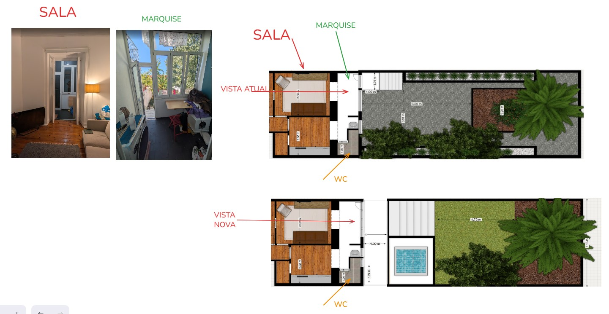
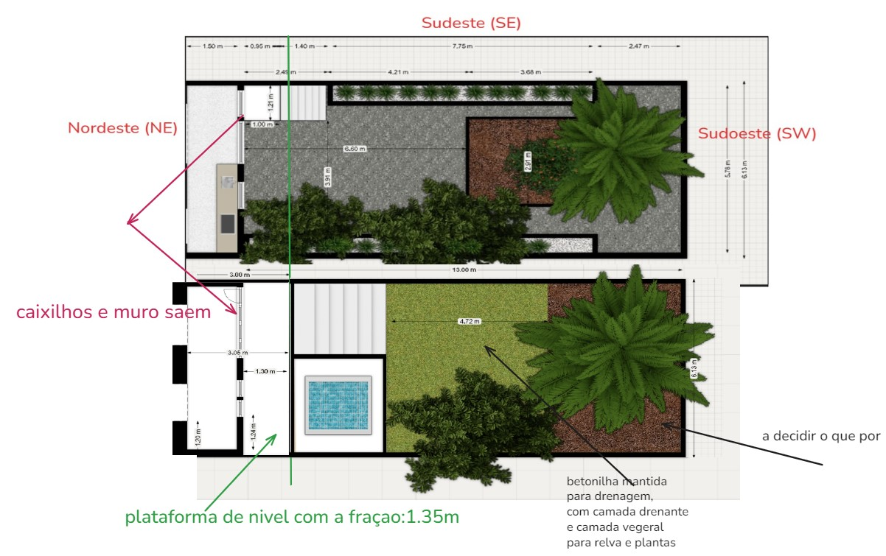
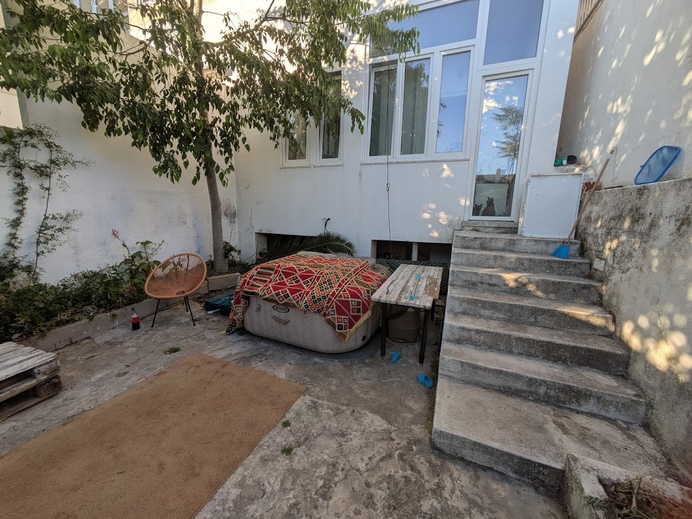
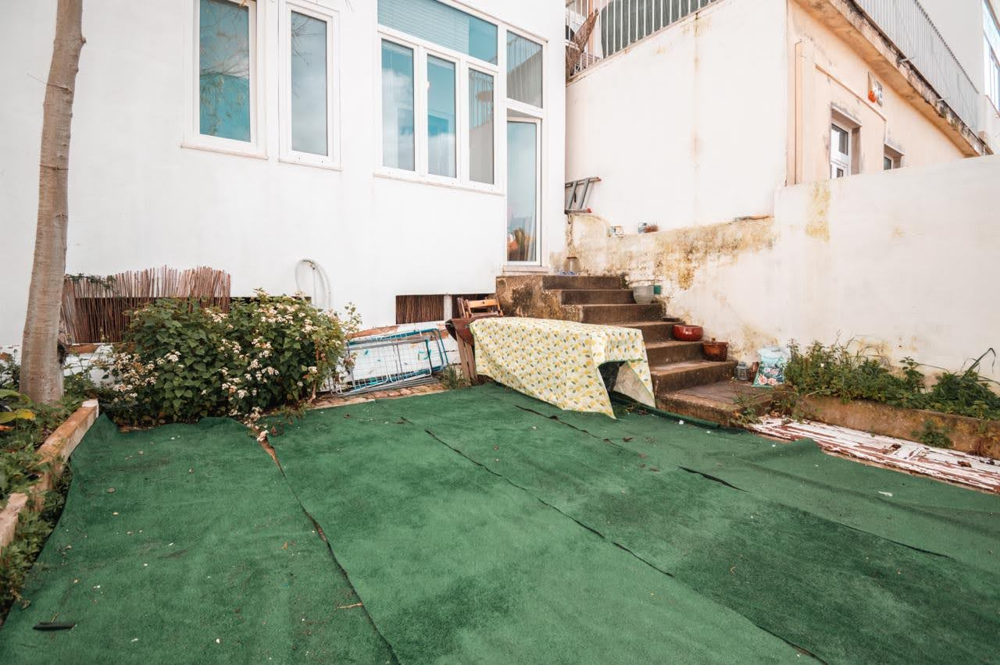
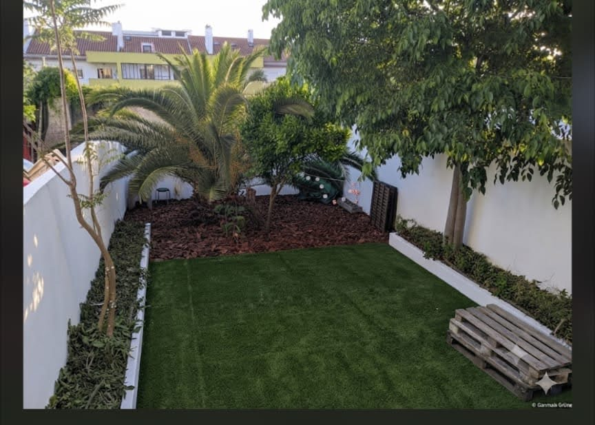
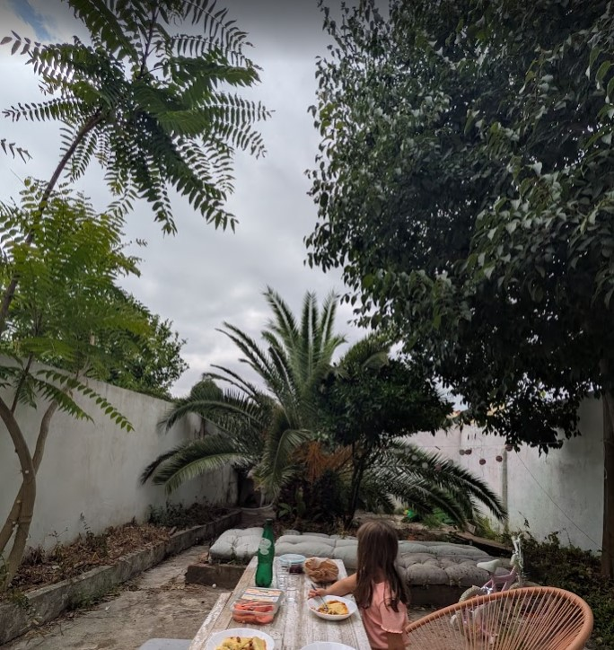
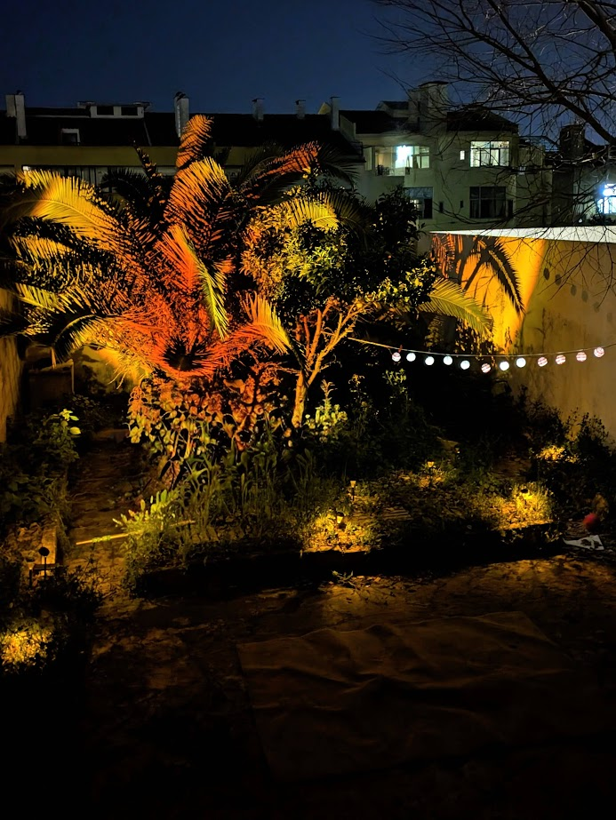
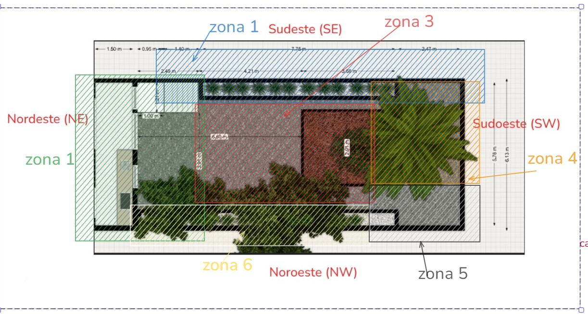

# A EXPLICAÇÃO DO LOCAL

## O que é este documento, e o que não é

> **A T001 diz *o que o local é*. Este documento diz *o que o local significa*.**

| | |
|---|---|
| **É** | A **explicação** do quintal: porque é que ele é como é, porque é que falhou quatro vezes, e o que é que o David quer que ele seja. |
| **Não é** | **Não é caracterização.** Não mede, não levanta, não substitui nada. A caracterização é a T001 e o documento canónico é `../T001-local/Docs-David-Local/DOSSIER-LOCAL.md`. |
| **Relação com a T001** | **Complemento.** Onde este documento e o dossier divergem, **o dossier ganha** — excepto nos dois factos da §5, que são correcções a comunicar à T001. |
| **Porque existe** | Porque a caracterização, sozinha, não explicava porque é que quatro planos tecnicamente viáveis morreram. A explicação está aqui. |

**Distinção mantida em todo o documento:** `[David]` é do David · `[foto]` lê-se da imagem ·
`[thread]` é interpretação da T002 · `[dossier]` é facto canónico da T001.

---

## 1. O problema não é o jardim — é a vista



> *«em cima é a situação actual: eu da sala vejo uma marquise com caixilhos tortos e muro. **não há
> jardim**. e tenho um desnível de 1.35m com escadas e betonilha. Em baixo vou passar a ver da sala
> um jardim porque vou ter tudo envidraçado.»* `[David, 2026-09-17]`

A montagem mostra a sala e a marquise como estão hoje: caixilhos velhos, máquina de lavar, roupa
estendida. **Da sala não se vê jardim nenhum.** Vê-se uma marquise, e atrás dela um muro. `[foto]`

### A consequência, e explica o projecto inteiro

**O jardim está 1,35 m abaixo do piso da casa e atrás de uma barreira opaca.** `[dossier §2.4]`

Isto não é um defeito de conforto. **É a explicação de porque é que quatro planos morreram sem
ninguém sentir a falta:** não havia nada, no dia-a-dia, a lembrar que o jardim existia. Não se vê da
sala, não se atravessa para ir a lado nenhum, e chegar lá custa sete degraus.
**O cliente do jardim nunca o viu.** `[thread]`

**O projecto do David não é «arranjar o jardim». É demolir a marquise e fazer o jardim começar dentro
da sala.** Tudo o resto — a plataforma, a piscina, a escada, os 50 cm de cota — é o mecanismo que
torna isso possível. `[thread]`

> **Correcção de rumo da thread, assumida:** a T002 andou a tratar isto como problema de jardim
> — quantas horas de sol tem cada zona, o que é que lá sobrevive. Não estava errado. Estava a
> responder à pergunta errada primeiro. `[thread]`

---

## 2. O que o David quer

> *«todas com os seus desafios técnicos e todas a precisar de tratamento para fazer o que eu quero:
> **um verdadeiro jardim**. eu quero um jardim **muito bonito de dia e cénico de noite**.»*
> `[David, 2026-09-17]`

**É o critério de aceitação do projecto.** Não é «um espaço utilizável», não é «vegetação adaptada
às condições do sítio». É um jardim a sério, belo de dia e cénico de noite. `[thread]`

**Consequência para o mandato:** o filtro 5 — gosto do David — deixa de ser uma pergunta a fazer no
fim e passa a ser **objectivo declarado à cabeça**. Uma proposta tecnicamente impecável que produza
um pátio arrumado em vez de um jardim bonito **falha**, mesmo passando os outros quatro filtros.
`[thread]`

---

## 3. O mecanismo — quatro planos de cota



```
  fracção / sala    ┬  +1,35 m   envidraçado TOTAL, recolhível. Caixilhos e muro SAEM.
  plataforma        ┼  +1,35 m   ≈1,50 m de profundidade. Continuidade da sala. Alpendre.
  transição         ┼   var.     piscina (h ≈0,70 m) + escada — o GRADIENTE de descida
  jardim            ┴  +0,50 m   sobre a betonilha mantida
```

**A plataforma está ao nível da fracção.** Os ≈1,50 m são **profundidade**, não desnível —
ambiguidade resolvida pelo David: *«plataforma de nível com a fracção: 1.35m»*. `[David, 2026-09-17]`

### Porquê a piscina e a escada

> *«Porquê a piscina e as escadas? **para haver um "gradiente" de descida**. A piscina no muro SE não
> faz sentido: a descida para o jardim é dessa porta que vem da sala.»* `[David, 2026-09-17]`

**A piscina não é equipamento de banho — é elemento de transição.** Parte o degrau de 1,35 m numa
sequência que se lê, em vez de uma escada. `[David]`

> **A thread tinha proposto mudar a piscina para SE. A proposta está retirada.** Avaliou-a como
> equipamento a optimizar para sol, ignorando que **a descida se faz pela porta da sala, que é a
> única entrada do jardim**. Pôr a piscina a SE era pô-la longe da única descida. `[thread]`

### E ocupa um vazio que já existe



A fotografia mostra o que só existia em planta: **o vão sob a marquise, ao lado da escada, hoje com o
jacuzzi insuflável lá metido e a servir de despejo.** `[foto]`

**A piscina não cria volume novo — ocupa um buraco.** `[thread]`

A mesma fotografia mostra mais três coisas que interessam: `[foto]`

- A **escada de betão é maciça e larga**, e ocupa o canto E inteiro. Em planta eram sete degraus;
  na fotografia é um bloco que domina metade da frente.
- A **abertura da caixa de ar** está visível sob a marquise, **semi-obstruída por entulho e
  vegetação**. `[dossier §9.3]`
- A **sombra do lodão cai sobre a fachada** às horas boas. O modelo solar não o tem. **É actor na
  zona 1, não só na zona 6.**

### O argumento que a thread não tinha visto



> *«no jardim passo a olhar para o prédio e o conjunto 50cm a mais de cota e envidraçado, **já não
> torna a fracção lá em cima**.»* `[David, 2026-09-17]`

A fotografia mostra o que o dossier não regista: **do jardim não se vê só a fachada própria.**
Vê-se o encaixe de três construções de alturas diferentes, incluindo **o muro alto e encardido do
vizinho a SE, com a escada exterior dele por cima**. A fracção **parece** estar «lá em cima».
`[foto]`

**Os 50 cm e o envidraçado não servem só para dar luz. Servem para reequilibrar a proporção de um
alçado que hoje esmaga o recinto.** Não aparece em nenhuma tabela de horas de sol, e é
provavelmente o argumento mais forte a favor da subida de cota. `[thread]`

### O que o mecanismo resolve de graça

**As grelhas de ventilação da caixa de ar deixam de ser um problema.** Eram a objecção mais dura à
subida de cota — subir 0,50 m tapava-as. Com a marquise fora e a plataforma a +1,35 m, a faixa junto
à fachada é **vazio sob estrado, não aterro**. A ventilação passa a ser desenhada na frente nova.
**Deixa de ser remendo e passa a ser consequência da forma.** `[thread]`

---

## 4. A palmeira é inegociável

> *«HÁ TAMBÉM UMA COISA INEGOCIÁVEL: **a palmeira é o ícone**.»* `[David, 2026-09-17]`

Três imagens, três argumentos distintos. Só as três juntas fazem o caso.

### O mockup — a composição funciona



Copa dá a escala, relva dá o plano, **os muros brancos desaparecem**. `[foto]` *(mockup, declarado
pelo David)*

### De dia — não há muros na fotografia



**Esta é a mais forte de dia.** Olha-se para a mesa e vê-se copa, céu e verde em três planos de
profundidade. **O recinto estreito e fundo desaparece porque o olhar sobe.** E é um dia cinzento —
não precisa de sol para funcionar. `[foto]` `[thread]`

### De noite — a imagem que não parece Alcântara



Copa iluminada de baixo em âmbar e laranja, **nenhuma luminária visível**, festão de globos,
vegetação acesa em primeiro plano. **É a única imagem de todo o material que não parece um quintal
em Alcântara.** `[thread]`

### A consequência para o método — uma correcção que se assume

**A thread tratou a palmeira como obstáculo solar:** «come o sol do quadrante SW», «a copa intercepta
o que entrar por um muro SW rebaixado». Tecnicamente correcto. **Irrelevante para a decisão.**
`[thread]`

**A palmeira não é variável a optimizar. É a razão de ser do jardim, e a sombra que faz é o preço do
que dá.** Passa a dado fixo, ao lado da geometria do recinto. `[thread]`

> ### E isto liquida a Ideia 1 como argumento de luz
>
> Rebaixar o muro SW valia sobretudo pelo sol que deixava entrar **no quadrante SW — que é
> exactamente o quadrante da palmeira**. O cálculo do pedido 4 corre **sem árvores**; com a palmeira,
> o ganho real é uma fracção. `[thread]`
>
> **O muro SW pode continuar a valer por vista, por proporção e por sensação de recinto. Como
> instrumento de luz, cai.** O pedido 5 à T003 — palmeira modelada — deixa de ser «só se já existir»
> e passa a ser **a pergunta que decide se vale a pena sequer discutir o muro SW**. `[thread]`

### Dois princípios de V1 deixam de ser hipótese

O mandato manda rever os 8 princípios herdados. **Dois já estão executados e fotografados:**

| Princípio | Prova |
|---|---|
| **#2** «Vê-se a luz, nunca a luminária» | `PALMEIRA-ICONE-NOITE.jpg` — copa acesa, nenhuma fonte visível |
| **#5** «Dois jardins num — mediterrânico de dia, instalação de noite» | As três imagens, literalmente |

**Não são princípios a confirmar. São descrições do que já funciona.** E o objectivo do David —
*«bonito de dia e cénico de noite»* — é a formulação de 2026 do mesmo princípio. A thread recomenda
ao Arquitecto que os absorva em `ESTADO.md` como decididos. `[thread]`

---

## 5. Dois factos que corrigem o dossier

**A thread não pode escrever em `10-LOCAL/` nem na pasta da T001** (regra T3). Vão pelo canal de
mensagens.

Ambos se lêem em `ANTES-vista-esmagada-altura-NE.jpeg`: `[foto]`

| # | Facto | Porque importa |
|---|---|---|
| **1** | **A relva artificial já existiu e ainda lá está** — placas descoladas sobre a betonilha. | O dossier descreve o pavimento como betonilha à vista. Não muda decisões; **o Local está desactualizado**. |
| **2** | **Os muros podem não ter todos a mesma altura.** O muro do vizinho a SE é visivelmente mais alto que 2,50 m e está noutro plano. | O David referiu **2,25 m**; o dossier diz **≤2,50 m** `[observado]`. |

### A medição que vale mais que qualquer modelo

**A 1,75 m relativos (2,25 − 0,50), Dezembro dá ≈2,3 h em vez de 1,7 h.** `[estimado T002]`

**Uma diferença de 35% na variável mais crítica do projecto, resolvida com uma fita métrica.**

> **Recomendação:** medir a altura dos quatro muros, troço a troço, **na mesma ida em que se abre o
> dreno**. Custo zero, 20 minutos, e fecha a maior incerteza do modelo solar. `[thread]`

---

## 6. As seis zonas — a grelha do David



> **Detalhe completo em `07-ZONAMENTO-DAVID.md`.** Aqui fica o essencial.

```
 X=0        X≈2,5              X≈6,7            X≈8,2      X=13,00
E├────────────┴───────────────────┴────────────────┴──────────┤S   Y=5,78
 │  ▓▓▓▓▓▓▓▓▓▓ ZONA 2 — muro SE · musgo · 0,0 h Dez ▓▓▓▓▓▓▓▓▓ │    ▲ MURO SE
 ├────────────┬────────────────────────────────┬──────────────┤    │
 │   ZONA 1   │           ZONA 3               │    ZONA 4    │    │
 │  desnível  │          central               │   PALMEIRA   │    │
 │  ⌂ ≈piscina│                                ├──────────────┤    │
 │            │                                │ ZONA 5 ◉dreno│    │
 ├────────────┴────────────────────────────────┴──────────────┤    │
 │ ▓▓▓▓▓▓▓ ZONA 6 — lodão ♣ · canteiro que produz · 4,9 h ▓▓▓▓ │    │
N└─────────────────────────────────────────────────────────────┘W   Y=0
```

| Zona | O David diz | Sol Dez (+0,50 m) |
|---|---|---|
| **1 — NE** | *«a zona 1 NE é o desnível»* | ≈2,3 h |
| **2 — muro SE** | *«o problema do muro que não recebe sol e tem sempre musgo»* | **0,0 h** |
| **3 — central** | *«a zona 3 é a central»* | ≈2,2 h |
| **4 — palmeira** | *«a zona 4 a da palmeira»* | ≈0,5 h **e menos** |
| **5 — canto W** | *«um canto morto mas que podia ser interessante (um pond?)»* | ≈0,5 h |
| **6 — lodão** | *«a do lodão e do canteiro onde crescem plantas»* | **≈4,9 h** |

*Sol: `05-LUZ-COTA-ESTIMATIVA-T002.md` — **estimado T002, a confirmar T003**, modelo sem árvores.*

### As zonas 2 e 6 parecem gémeas e são opostas

Duas faixas de largura semelhante, encostadas a muros paralelos, uma de cada lado. **Em sol de
Inverno são o extremo oposto do jardim: 4,9 h contra 0,0 h.** `[thread]`

**Porquê:** a zona 6 está encostada ao muro que fica **a norte** dela — o sol da tarde atravessa o
jardim e vai lá bater. A zona 2 está encostada ao muro que está **entre ela e o sol**. Não é
subtileza de microclima: é estar à frente ou atrás do obstáculo. `[thread]`

**O David já lhe chama, sem precisar do cálculo, «o canteiro onde crescem plantas». A designação
dele bate certo com o número.** `[thread]`

> **Tratar as zonas 2 e 6 como um par simétrico de canteiros lineares seria o erro clássico deste
> quintal.**

### A zona 6 é o recurso desperdiçado

**A faixa com mais sol de Inverno de todo o quintal — quase o triplo da média — e na planta tem sebe
por cima.** Nunca foi tabelada no dossier, logo **nunca entrou no raciocínio de vegetação de nenhum
dos quatro planos**. É a única zona que já hoje prova produtividade sem ninguém a tratar. `[thread]`

### A zona 2 — o musgo é sintoma, não causa

**0,0 h de sol directo em Dezembro. Nenhuma cota a salva** — o Sol nunca sobe o suficiente para
passar por cima de um muro a 2,00 m e iluminar uma faixa de 0,60 m encostada a ele. `[thread]`

Sombra permanente de Outubro a Março **+** escorrência vertical documentada `[dossier §7.2]`
**= colonização biológica.**

> **A zona 2 não se resolve com escolha de plantas.** Ou se resolve a origem da água — 🔴 no dossier,
> por identificar — ou planta-se contra uma parede que vai ter de ser picada. `[thread]`

---

## 7. A laranjeira sai

> *«quanto à laranjeira: **tem de sair de onde está. tapa a palmeira**. se vai para vaso ou para
> outro lado não sei.»* `[David, 2026-09-17]`

**Decisão registada.** O destino fica em aberto. O motivo é de composição e é coerente com a palmeira
ser o ícone: em `Palmeira-icone2.jpg` e `PALMEIRA-ICONE-NOITE.jpg` vê-se a copa da citrinheira a
cruzar-se com a base da palmeira no enfiamento a partir da casa. `[thread]`

> ### ⚠ A JANELA — a restrição mais dura do projecto
>
> **O transplante de citrinos faz-se em Fevereiro / início de Março.** Janela de ≈6 semanas por ano,
> e **não se negoceia com roadmap.** `[dossier · V1]`
>
> **Hoje é 2026-09-17. A próxima janela é Fev–Mar 2027. Se passar, é Fev–Mar 2028.**
>
> **E aqui está o que interessa para a sequência:** tirar a laranjeira **não depende do dreno, nem da
> cota, nem do envidraçado, nem de terceiro nenhum**. Depende só do David — e **tem prazo**.
> `[thread]`

---

## 8. Porque é que quatro planos morreram — a explicação, agora completa

| Plano | Data | Porque parou `[dossier]` |
|---|---|---|
| V1 completo (F1–F6) | até Mar 2026 | Dependia de três terceiros e de encadeamento rígido |
| Conceito 3 ambientes | Fev 2026 | Recusado: sem discriminação de custos |
| DIY temporário | Mai–Jul 2026 | A janela expirou sem balanço |
| Dossier palmeira | Mai 2026 | Nunca integrado |

**A leitura do Arquitecto era:** V1 não parou por ser ambicioso — parou porque nada podia acontecer
antes da demolição, e a demolição dependia de terceiros.

**A explicação que estas imagens acrescentam, e que faltava:** `[thread]`

> **Nenhum dos quatro planos tinha urgência, porque o jardim era invisível.**
>
> Um plano que depende de terceiros e que **ninguém vê falta** não é adiado — é abandonado sem
> decisão. A dependência explica **por que parou**; a invisibilidade explica **por que ninguém o
> retomou**.

**E é por isso que esta proposta é diferente das outras quatro:** a primeira coisa que ela faz é
**tornar o jardim visível da sala**. A partir daí, o próprio David passa a ser a pressão que
nenhum dos planos anteriores teve. `[thread]`

---

## 9. O que continua por resolver

| Questão | Estado |
|---|---|
| **Altura real dos muros** — 2,25 ou 2,50 m? | **Fita métrica.** Maior incerteza do modelo, custo zero. |
| **Para onde vai a laranjeira** | Vaso ou outro sítio. **Decidir antes de Fev 2027.** |
| **Carga da piscina** — ≈1,1 t em ≈1,6 m² (≈700 kg/m²) | Carga **pontual** sobre betonilha fissurada e caixa de ar. Declarada, não dimensionada. **Torna o ticket T1 mais urgente.** |
| **O que está sob o canto N** | Antes de lá pôr água. A abertura da caixa de ar está semi-obstruída. |
| **Quanto a palmeira desconta ao cenário D** | T003, pedido 5 — **promovido a decisivo** |
| **A origem da água no muro SE** | 🔴 `[dossier]`. Bloqueia a zona 2. |
| **O lodão** — actor na zona 1 e na zona 6 | Não está no modelo solar |
| **Fronteira 3/4 e a numeração da zona 2** | Ver `07-ZONAMENTO-DAVID.md` |

---

## PROVENIÊNCIA

| Item | Origem |
|---|---|
| Reformulação como problema de vista · quatro planos de cota · gradiente · argumento da proporção · palmeira inegociável · as seis zonas · laranjeira sai · o objectivo | **David**, 2026-09-17 — conversa + 7 imagens em `David-Docs/` |
| Leitura das imagens | `[foto]` — descrição do que está visível |
| Interpretação, correcções de método, queda da Ideia 1, diagnóstico da zona 2, explicação dos quatro planos | **T002** `[thread]` |
| Horas de sol | `05-LUZ-COTA-ESTIMATIVA-T002.md` — **estimado pela T002, a confirmar pela T003** |
| Cotas, patologias, posição das árvores, janela do citrino | `DOSSIER-LOCAL.md` — **canónico, T001** |

**Documentos irmãos:** `06-PROJECTO-REFORMULADO-VISTA.md` (versão longa da §1–§5) ·
`07-ZONAMENTO-DAVID.md` (versão longa da §6) · `../David-Docs/INDICE.md` (ficha de cada imagem)
