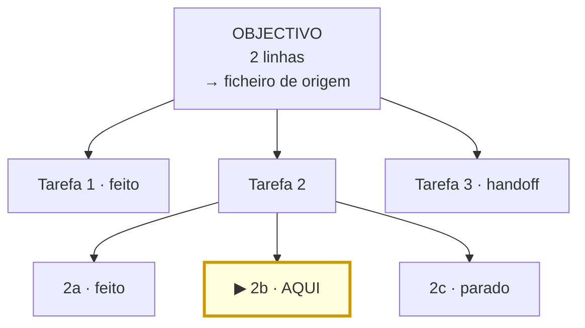

# Árvore da Sessão — âncora base

Serve para qualquer sessão, em qualquer lado (Governo, Arquiteto, Thread). Vive em `Arvore.md` na pasta da sessão.

## Regras

1. **A sessão começa com um objectivo.** Raiz da árvore: objectivo ou problema inicial, em 2 linhas, a apontar para
   o ficheiro de onde veio (handoff, registo do David, prompt).
2. **Fez-se uma tarefa?** Ramo para baixo.
3. **A tarefa dividiu-se?** Ramos paralelos. Segue-se **um**, e marca-se qual.
4. **Foi preciso partir o objectivo?** Fica a árvore com o objectivo original em cima e o novo ramo por baixo, com
   a razão. A deriva fica visível, não desaparece.
5. **Depois de cada tarefa e de cada feedback: olhar para a árvore.** Onde estou? O ramo serve a raiz?
6. **Ao fechar:** cada folha fica `feito`, `parado` ou `handoff`.

## Template

Legenda: `▶ AQUI` é o único ramo activo. `feito` · `parado` · `handoff` nas folhas.
