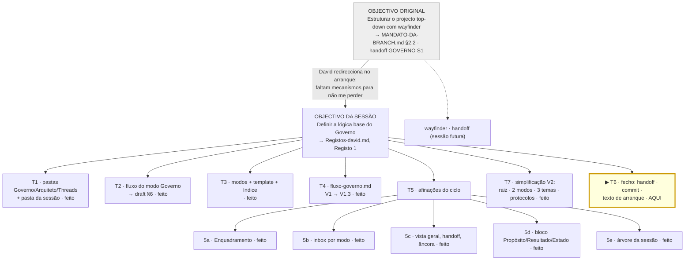

# Árvore — 2026-09-18-B1-Governo-S1

```mermaid
flowchart TB
    O0["OBJECTIVO ORIGINAL<br/>Estruturar o projecto top-down com wayfinder<br/>→ MANDATO-DA-BRANCH.md §2.2 · handoff GOVERNO S1"]
    O0 -- "David redirecciona no arranque:<br/>faltam mecanismos para não me perder" --> O1["OBJECTIVO DA SESSÃO<br/>Definir a lógica base do Governo<br/>→ Registos-david.md, Registo 1"]
    O1 --> T1["T1 · pastas Governo/Arquiteto/Threads<br/>+ pasta da sessão · feito"]
    O1 --> T2["T2 · fluxo do modo Governo<br/>→ draft §6 · feito"]
    O1 --> T3["T3 · modos + template + índice<br/>· feito"]
    O1 --> T4["T4 · fluxo-governo.md<br/>V1 → V1.3 · feito"]
    O1 --> T5["T5 · afinações do ciclo"]
    T5 --> T5a["5a · Enquadramento · feito"]
    T5 --> T5b["5b · inbox por modo · feito"]
    T5 --> T5c["5c · vista geral, handoff, âncora · feito"]
    T5 --> T5d["5d · bloco Propósito/Resultado/Estado · feito"]
    T5 --> T5e["5e · árvore da sessão · feito"]
    O1 --> T7["T7 · simplificação V2:<br/>raiz · 2 modos · 3 temas · protocolos · feito"]
    O1 --> T6["▶ T6 · fecho: handoff · commit ·<br/>texto de arranque · AQUI"]
    O0 -.-> W["wayfinder · handoff (sessão futura)"]
    style T6 fill:#ffd,stroke:#c90,stroke-width:3px
    style O0 fill:#eee,stroke:#999
```
