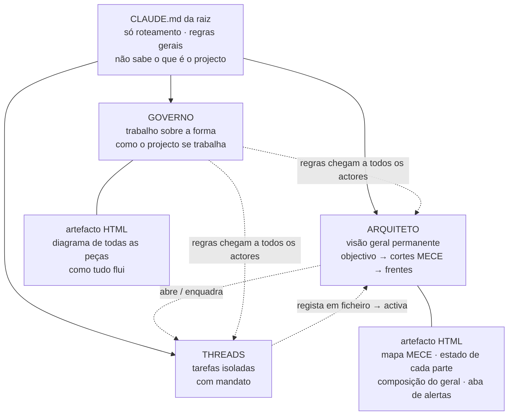
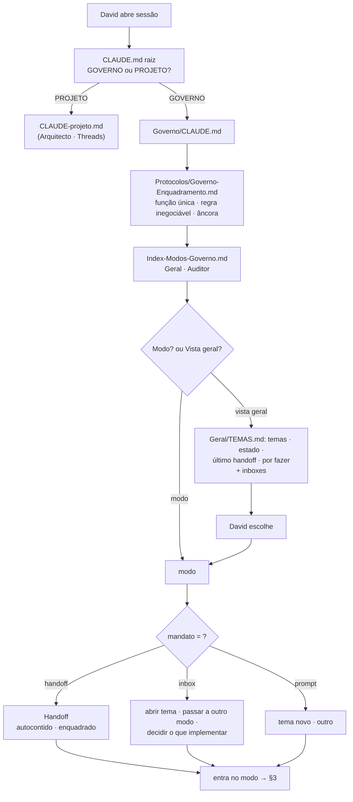
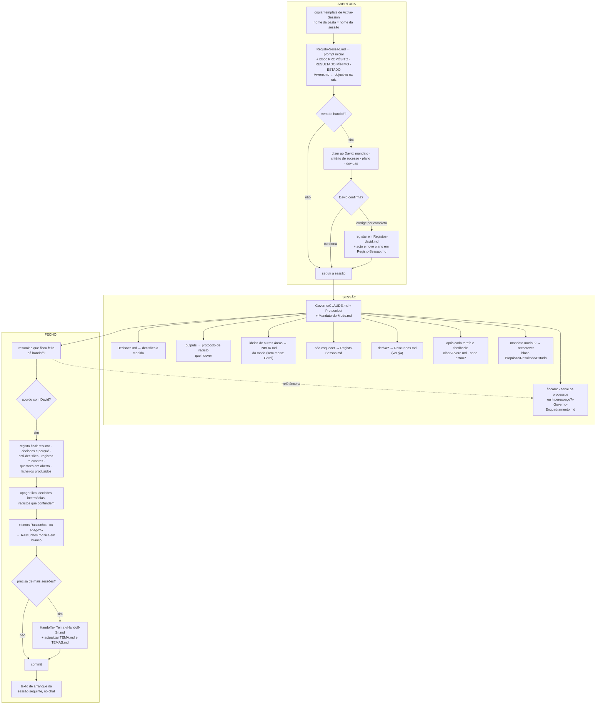
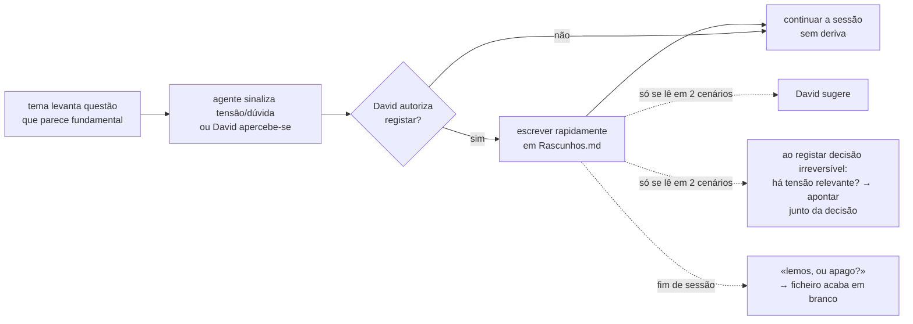
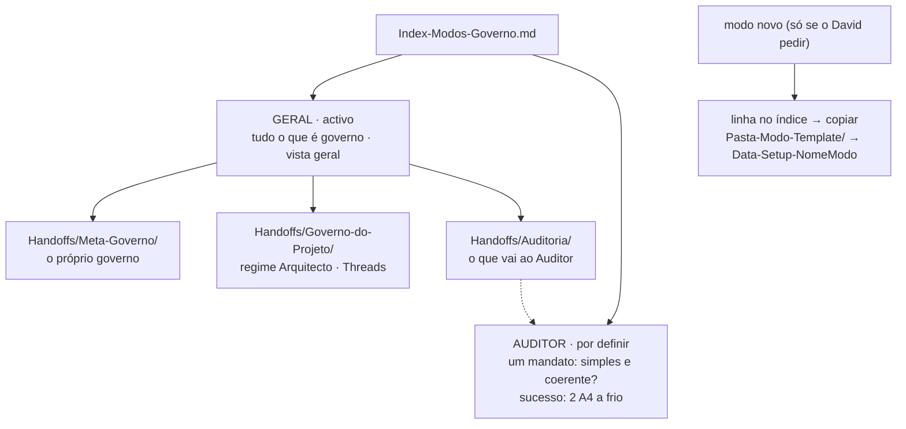
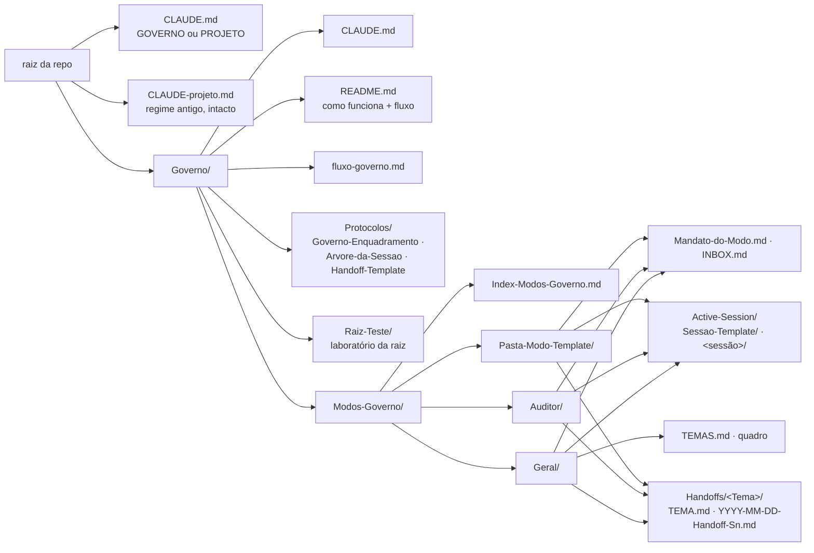

# Fluxo do Governo — diagramas

**V1** registada a 2026-09-18 (aprovada pelo David «bastante bem por agora»). **V1.1**: afinação do arranque
(Governo-Enquadramento.md, inbox por modo). **V1.2**: «modo ou vista geral», handoff como mandato, dois tipos de
handoff, inbox como semente de tema, âncora de regras. **V1.3**: bloco Propósito · Resultado mínimo · Estado no Registo-Sessao; template de Active-Session. **V1.4**: Arvore.md por sessão.
**V2** (fecho da S1): raiz pergunta GOVERNO/PROJETO · dois modos (Geral, Auditor) · três temas do Geral ·
protocolos e Raiz-Teste só na raiz do Governo · texto de arranque no fecho. **V2.1**: quadro `TEMAS.md` + `TEMA.md` por tema.

> Provisório. Fonte: `Modos-Governo/Geral/Active-Session/2026-09-18-B1-Governo-S1/Registos-david.md` (Registos 1 e 2)
> e `Estruturacao-governo-draft.md`. Os papéis de Arquiteto e Governo em §1 são princípios a discutir.

## 1. A organização — três modos

**Princípios a discutir (não canónicos):**
- Arquiteto sempre aberto em paralelo, activado quando uma thread regista algo; abre logo o fio novo. Enquadra o que surge (thread nova, inbox) por skill ou subagente; diz «Stop» quando tem de ser.
- Governo tem duas formas permanentes: sessões que implementam uma ferramenta; sessões ou skills que mantêm o artefacto HTML do fluxo.
- Threads: isolamento real, mais via expedita para sobreposições (por resolver).

## 2. Entrada numa sessão de Governo (V2)

## 3. Ciclo de vida de uma sessão de Governo

## 4. Rascunhos.md — o travão às derivas

## 5. Modos e temas (V2)

Um tema é uma pasta em `Handoffs/<Tema>/` com **`TEMA.md`** (mandato fixo · estado · por fazer) e os handoffs.
O quadro de todos os temas é **`Geral/TEMAS.md`**: é o que se lê quando o David pergunta «o que temos?».

## 6. Estrutura de pastas (V2)

## 7. Lacunas (V2)

| # | Lacuna | Onde |
|---|---|---|
| L2 | Auditor por definir: sessão `Data-Setup-Auditor` | §5 |
| L4 | Protocolo de registo de outputs por definir | §3 |
| L7 | Mecanismo de activação do Arquiteto por escrita de ficheiro | §1 (Governo-do-Projeto) |
| L8 | Via expedita para sobreposições entre threads | §1 (Governo-do-Projeto) |
| L10 | `Arquiteto/` e `Threads/` na raiz estão vazias; o regime do projecto continua em `CLAUDE-projeto.md` e `30-THREADS/` | §6 (Governo-do-Projeto) |
| L11 | `Handoffs-Arquiteto/` e `Registos-Arquiteto/` na raiz: migrar ou manter | §6 (Governo-do-Projeto) |

Fechadas em V2: L1 (Governo/CLAUDE.md), L3 (template), L5 (roteamento), L6 (Raiz-Teste e Protocolos), L9 (vista geral = listagem).
